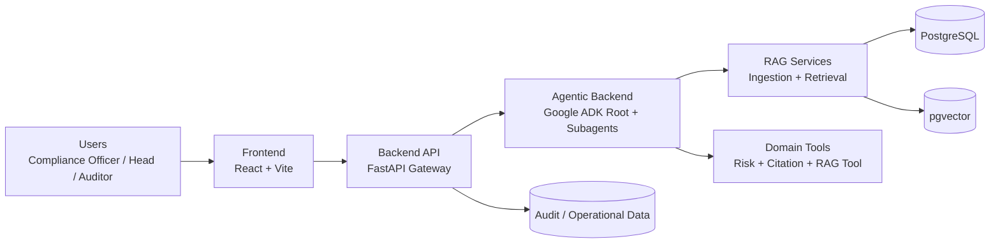
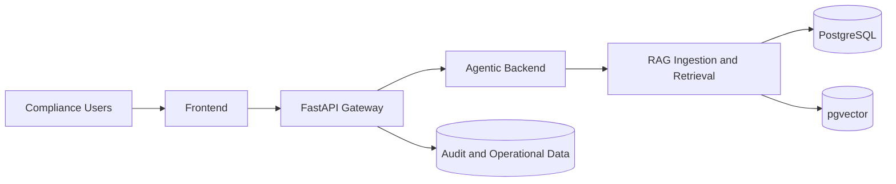
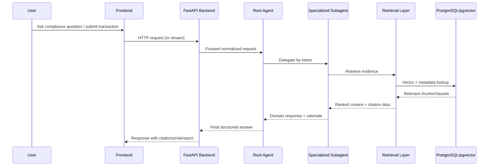

# CORA — Complete Architecture

> Compliance Oriented Regulatory Assistant — Consolidated Architecture Reference

| | |
|---|---|
| **System** | CORA (Compliance Oriented Regulatory Assistant) |
| **Version** | 1.0 (Consolidated) |
| **Date** | 2026-06-29 |
| **Author / Solution Architect** | Arun S. P. |
| **Document ID (SARB)** | CORA-SARB-001 |
| **Prepared For** | Architecture Review Board, Security, Platform/SRE, Compliance/Legal, Product |

> **About this document.** This is the single, complete architecture reference for CORA. It consolidates and supersedes the following source documents for reading convenience:
> - `docs/Architecture_Document.md` (current + target architecture)
> - `docs/Architecture_Review.md` (SARB: assumptions, constraints, risks, sign-off)
> - `docs/rag/RAG_Solution_Architecture_Design.md` (RAG ingestion/retrieval design)
> - `README.md` (product overview, structure, agents, setup)
> - `evaluation/README.md` (RAGAS evaluation framework)
> - `docs/CORA-Architecture Decision Records.pdf` (The 3 CORA Architecture Decision Records (ADRs))

## Demo: UI Navigation

A short walkthrough of the CORA user interface.

[](https://youtu.be/WCiHx9okBFE)

---

## Table of Contents

1. [Executive Summary](#1-executive-summary)
2. [Business Context and Objectives](#2-business-context-and-objectives)
3. [Scope](#3-scope)
4. [System Overview](#4-system-overview)
5. [Functional Architecture](#5-functional-architecture)
6. [Logical and System-Context Architecture](#6-logical-and-system-context-architecture)
7. [Component Architecture](#7-component-architecture)
8. [Agentic Backend — Root Agent and Sub-Agents](#8-agentic-backend--root-agent-and-sub-agents)
9. [Guardrails and Safety](#9-guardrails-and-safety)
10. [RAG Solution Architecture and Design](#10-rag-solution-architecture-and-design)
11. [Technology Stack](#11-technology-stack)
12. [Data Architecture and Governance](#12-data-architecture-and-governance)
13. [Deployment Architecture (Container + Kubernetes + GCP)](#13-deployment-architecture-container--kubernetes--gcp)
14. [Security Architecture and Compliance Posture](#14-security-architecture-and-compliance-posture)
15. [Observability and Operations](#15-observability-and-operations)
16. [Non-Functional Requirements and Target SLOs](#16-non-functional-requirements-and-target-slos)
17. [Quality and Evaluation (RAGAS Framework)](#17-quality-and-evaluation-ragas-framework)
18. [Assumptions and Constraints](#18-assumptions-and-constraints)
19. [Risk Register](#19-risk-register)
20. [Architecture Decisions (ADRs)](#20-architecture-decisions-adrs)
21. [Delivery Roadmap and Known Gaps](#21-delivery-roadmap-and-known-gaps)
22. [Open Questions and Review Sign-Off](#22-open-questions-and-review-sign-off)
23. [Project Structure and File-by-File Reference](#23-project-structure-and-file-by-file-reference)
24. [Installation and Run Guide](#24-installation-and-run-guide)
25. [Appendix — Repository Artifacts and Traceability](#25-appendix--repository-artifacts-and-traceability)

---

## 1. Executive Summary

CORA (Compliance Oriented Regulatory Assistant) is a multi-service, AI-powered platform for financial compliance workflows. Think of it as a smart compliance co-pilot for a bank: instead of manually reading hundreds of pages of regulations and checking transactions one by one, CORA combines **AI search + reasoning + compliance workflow** in one platform.

It combines retrieval-augmented reasoning, specialized domain agents, and API-driven integration to support:

- Regulatory Q&A with citations
- Transaction compliance screening with risk rationale
- Regulatory change impact analysis
- Structured report generation
- Audit-ready traceability and explainability

The implemented platform leverages:

- **Google ADK** for agentic orchestration (root agent + 4 sub-agents)
- **FastAPI** for backend services and the API gateway
- **PostgreSQL + pgvector** as the unified relational + vector store
- **Hybrid retrieval** (BM25 keyword + vector search) with Reciprocal Rank Fusion and reranking
- **BGE embeddings** (`BAAI/bge-large-en-v1.5`) and a BGE reranker
- **Locally hosted open-source LLM** (default `llama3.1:8b` via Ollama/vLLM); Gemini 2.5 Pro is referenced as the target reasoning model in the original RAG design
- **Containers + Kubernetes**, targeting **GCP (GKE / Cloud Run)** for deployment

The current implementation is production-oriented at the service-layout level (frontend, API, agentic backend, data layer, Kubernetes manifests) but still requires hardening in identity, security controls, asynchronous processing, and observability before enterprise production rollout.

**Primary users / personas:**

- Compliance Officer
- Compliance Head
- Internal Auditor

---

## 2. Business Context and Objectives

**Problem:**

- Regulatory knowledge is high-volume and frequently changing.
- Manual compliance interpretation and transaction review is slow and inconsistent.
- Audit traceability demands explainable decisions with source evidence.

**Objectives:**

1. Reduce manual compliance analysis effort.
2. Improve speed and consistency of regulatory interpretation.
3. Provide explainable outputs with citations and reproducible evidence trails.
4. Establish a scalable architecture for cross-jurisdiction compliance use cases.

---

## 3. Scope

**In scope:**

- Frontend, backend API, agentic backend, RAG, and data storage architecture
- Container and Kubernetes deployment model
- Core security and observability recommendations
- Evaluation and quality posture

**Out of scope (for this release document):**

- Detailed UI/UX specification
- Full legal interpretation policy and jurisdiction-specific legal sign-off process
- Disaster recovery runbook detail
- Full infrastructure-as-code blueprint

---

## 4. System Overview

CORA helps compliance teams:

1. **Ingest** regulatory documents (Basel III, MiFID II, RBI directions, AML/KYC frameworks, and updates).
2. **Answer** natural-language compliance questions with evidence/citations.
3. **Screen** transactions and highlight likely compliance risks.
4. **Explain** why a decision was made (audit trail and traceability).
5. **Generate** compliance reports for officers, heads, and auditors.

**High-level request flow:**

1. User interacts via the frontend.
2. The FastAPI backend receives requests.
3. The backend routes chat/screening tasks to the agentic backend.
4. The agentic backend uses tools (RAG, risk, citation) and returns responses.
5. The backend streams or returns the final answer to the frontend.

---

## 5. Functional Architecture

Core capabilities (functional requirements):

| ID | Capability | Description |
|---|---|---|
| **FR1** | Regulatory document ingestion | Ingests PDF, DOCX, TXT, MD; parses and chunks content; generates embeddings into pgvector; tracks metadata (source, version, effective date). |
| **FR2** | Natural-language Q&A | User asks in plain English; system retrieves relevant clauses; agent generates grounded answers with citations and confidence context. |
| **FR3** | Transaction screening | Accepts a transaction payload; applies retrieval + reasoning + risk scoring; returns risk level and rationale. |
| **FR4** | Regulatory change impact analysis | Compares new/changed regulatory material; flags likely policy/process impact areas. |
| **FR5** | Report generation | Produces structured compliance summaries for operational reporting and review workflows. |
| **FR6** | Auditability and explainability | Captures evidence-oriented outputs and source traceability; supports audit review with retrievable context. |
| **FR7** | Evaluation readiness | Includes evaluation scaffolding and a RAGAS-based evaluation framework. |

---

## 6. Logical and System-Context Architecture

### 6.1 Logical Architecture



### 6.2 System Context



### 6.3 Architecture Style

- Service-oriented architecture with bounded responsibilities (UI, API, agentic runtime, data layer)
- Agent-orchestrated reasoning using a **root-and-subagent** pattern
- **Retrieval-augmented generation (RAG)** pattern for grounded, citation-first answers
- Shared relational + vector persistence (PostgreSQL + pgvector)
- Container-first deployment design with Kubernetes manifests

### 6.4 Extensive High-Level Architecture Diagram


> *Figure: High-level view showing all subsystems — user personas, frontend, FastAPI gateway, agentic orchestration (root + 4 sub-agents), RAG pipeline (ingestion + hybrid retrieval + reranking), model serving (embedding, reranker, LLM), data layer (PostgreSQL, pgvector, audit store, raw doc store), and observability / security stack.*

---

## 7. Component Architecture


> *Figure: End-to-end component interaction view — frontend (React App, Report Viewer, Audit Trace Viewer), FastAPI gateway (auth middleware, query / screening / report controllers), agent layer (router agent + 4 sub-agents + tools), RAG ingestion pipeline (loader → parser → section splitter → version manager → embedding worker), hybrid retrieval chain (vector search, keyword search, fusion, reranker, context compressor, citation formatter), and storage tier (PostgreSQL, pgvector, audit store, blob store).*

### 7.1 Frontend

- **Location:** `frontend/`
- **Responsibilities:** User interaction for chat and compliance workflows; API integration for request/response and streaming; UI state management and workflow screens.
- **Technology:** React, TypeScript, Vite, TailwindCSS.

### 7.2 Backend API

- **Location:** `backend_api/`
- **Responsibilities:** External API boundary and routing; health and domain endpoints; request validation and response shaping; integration bridge to the agentic backend.
- **Representative API modules:**
  - `api/v1/health.py`
  - `api/v1/chats.py`
  - `api/v1/transactions.py`
  - `api/v1/regulations.py`
  - `api/v1/reports.py`
  - `api/v1/audit.py`

### 7.3 Agentic Backend

- **Location:** `backend_agentic/`
- **Responsibilities:** Multi-agent orchestration for domain tasks; intent routing and specialized reasoning; tool orchestration for retrieval, citation, and risk.
- **Agent layout:**
  - Root agent: `agents/compliance_agent.py`
  - Subagents: `agents/subagents/retrieval_agent.py`, `risk_agent.py`, `report_agent.py`, `change_impact_agent.py`

(Detailed agent behavior in [Section 8](#8-agentic-backend--root-agent-and-sub-agents).)

### 7.4 RAG and Model Layer

- **RAG ingestion:** `backend_agentic/rag/ingestion/`
- **RAG retrieval:** `backend_agentic/rag/retrieval/`
- **LLM routing:** `backend_agentic/models/llm_router.py`
- **Embeddings:** `backend_agentic/models/embeddings_model.py`
- **Tooling:** `backend_agentic/tools/rag_tool.py`, `citation_tool.py`, `risk_calculator.py`

### 7.5 Data Layer

- **Location:** `data_layer/`
- **Responsibilities:** Relational persistence (PostgreSQL); semantic retrieval index (pgvector); schema evolution and verification scripts.
- **Representative files:**
  - `data_layer/postgres/schema.sql`
  - `data_layer/postgres/schemaV2.sql`
  - `data_layer/postgres/verification.sql`
  - `data_layer/vector_store/pgvector_adapter.py`

### 7.6 Requirements Traceability Summary

| Requirement | Capability | Primary Components |
|---|---|---|
| FR1 Ingestion | Parse, chunk, embed, store | Agentic RAG ingestion, PostgreSQL, pgvector |
| FR2 Q&A | Grounded answers with citations | Retrieval agent, RAG retrieval, citation tool |
| FR3 Screening | Risk analysis and rationale | Risk agent, risk calculator, retrieval/citation tools |
| FR4 Change impact | Delta interpretation and impact summary | Change impact agent, retrieval layer |
| FR5 Reporting | Structured compliance reporting | Report agent, API report endpoints |
| FR6 Auditability | Evidence trace and explainability | Audit endpoints, citation flow, logs |
| FR7 Evaluation | Retrieval and answer quality validation | Evaluation module with RAGAS workflows |

### 7.7 Diagram-to-Code Alignment (Component View)

| Diagram component | Maps to current code | Status |
|---|---|---|
| Frontend: React App / Report Viewer / Audit Trace Viewer | `frontend/src` (`ChatInterface.tsx`, `pages/DocumentManager.tsx`, components) | Implemented (viewers are UI areas) |
| Backend: FastAPI Gateway | `backend_api/main.py` | Implemented |
| Query / Transaction Screening / Report Controllers | `backend_api/api/v1/regulations.py`, `transactions.py`, `reports.py`, `chats.py`, `audit.py` | Implemented |
| Auth Middleware | only CORS middleware exists today (`backend_api/main.py`) | Partial (CORS only; auth is target-state) |
| Agent Layer: Router Agent | `backend_agentic/agents/compliance_agent.py` | Implemented |
| Report Composer / Change Impact / Cross-Reg Reasoner / Transaction Risk | `backend_agentic/agents/subagents/report_agent.py`, `change_impact_agent.py`, `retrieval_agent.py`, `risk_agent.py` | Implemented |
| Retriever Tool | `backend_agentic/tools/rag_tool.py` | Implemented |
| Ingestion: Loader / Parser / Section Splitter / Version Manager / Embedding Worker | `backend_agentic/rag/ingestion/ingest_pipeline.py` (steps consolidated in one module) | Implemented |
| Retrieval: Vector / Keyword / Hybrid Fusion / Reranker / Context Compressor / Citation Formatter | `backend_agentic/rag/retrieval/retriever.py` + `backend_agentic/tools/citation_tool.py` | Implemented |
| Storage: PostgreSQL / pgvector / Audit Store / Blob Store | `data_layer/postgres`, pgvector, audit tables, `backend_api/uploads/regulations` | Implemented |
| Models: Embedding / Generation / Routing / Reranker | `backend_agentic/models/embeddings_model.py`, `backend_agentic/models/llm_router.py`, env reranker | Implemented |

---

## 8. Agentic Backend — Root Agent and Sub-Agents

The agentic backend (`backend_agentic/`) is a Google ADK multi-agent system. A single **root agent** orchestrates **four specialized sub-agents**, delegating each user request to the right one. All agents run on the same local open-source LLM (Ollama/vLLM) via `OpenSourceLlmRouter`, and share three function tools.

### 8.1 Models Used

The platform runs entirely on locally hosted open-source models — no external/cloud LLM API is required.

| Purpose | Model | Where configured | Served by |
|---|---|---|---|
| LLM (generation / reasoning for the root agent and all sub-agents) | `llama3.1:8b` (default; overridable via `OLLAMA_MODEL`) | `backend_agentic/models/llm_router.py` | Local Ollama / vLLM at `OLLAMA_API_BASE` (default `http://localhost:11434/v1`) |
| Embeddings (RAG vectorization for ingestion and retrieval) | `BAAI/bge-large-en-v1.5` (default; overridable via `EMBEDDING_MODEL_NAME`) | `backend_agentic/models/embeddings_model.py` | Local `sentence-transformers` (HuggingFace, offline cache) |

Notes:
- The LLM model name is sent on every request to the Ollama/vLLM `/chat/completions` endpoint; a smaller `llama3.2:3b` is available as a commented alternative for lower-resource machines.
- Embeddings are generated with normalized vectors and stored in PostgreSQL/pgvector.

### 8.2 Root Agent

- **Name:** `compliance_agent` (defined in `backend_agentic/agents/compliance_agent.py`)
- **Role:** Root orchestrator — CORA's "brain" that interprets the user's intent and routes the task to the appropriate sub-agent, or answers directly using its own tools.
- **Instruction:** `ROOT_COMPLIANCE_PROMPT` (`backend_agentic/agents/prompts/root_prompt.py`)
- **Sub-agents:** `retrieval_agent`, `risk_agent`, `report_agent`, `change_impact_agent`
- **Tools (also available to it directly):**
  - `query_regulatory_knowledge_base` — RAG search over the regulatory knowledge base.
  - `calculate_transaction_risk` — risk scoring for a transaction payload.
  - `generate_and_verify_citation` — builds and verifies source citations.
- **Exposed via:** `backend_agentic/main.py` (ADK `Runner`) at `POST /v1/agent/chat` and `POST /v1/agent/chat/stream` (SSE).

### 8.3 Sub-Agents (4 total)

| # | Sub-agent | File | Functionality | Tools used |
|---|---|---|---|---|
| 1 | `retrieval_agent` | `subagents/retrieval_agent.py` | Answers natural-language regulatory questions (FR2) by retrieving relevant clauses from RBI, Basel III, MiFID II, FATF, etc., and returning cited answers. | `query_regulatory_knowledge_base`, `generate_and_verify_citation` |
| 2 | `risk_agent` | `subagents/risk_agent.py` | Screens a transaction payload against compliance rules (FR3) and returns a structured risk assessment with risk rating and required remediation actions. | `calculate_transaction_risk`, `query_regulatory_knowledge_base`, `generate_and_verify_citation` |
| 3 | `report_agent` | `subagents/report_agent.py` | Generates structured weekly/monthly compliance reports (FR5) in Markdown, with cited evidence. | `query_regulatory_knowledge_base`, `generate_and_verify_citation` |
| 4 | `change_impact_agent` | `subagents/change_impact_agent.py` | Analyzes newly ingested circulars/amendments (FR4) to evaluate their impact on existing bank policies, derivative rules, and NBFC frameworks. | `query_regulatory_knowledge_base`, `generate_and_verify_citation` |

### 8.4 Orchestration Flow

```text
User request
     |
     v
compliance_agent (root)
     |  routes by intent
     +--> retrieval_agent       (regulatory Q&A)
     +--> risk_agent            (transaction screening)
     +--> report_agent          (compliance reporting)
     +--> change_impact_agent   (regulatory change impact)
                 |
                 v
        Shared tools: RAG search, risk calc, citation
                 |
                 v
        pgvector + PostgreSQL knowledge base
```

Each sub-agent has `disallow_transfer_to_parent=False`, so control can return to the root agent after a delegated task completes, allowing multi-step compliance workflows in a single conversation.

### 8.5 Agent Orchestration Sequence (End-to-End)



### 8.6 Sample Compliance Assessment

**Sample input:**

```text
Cross-border payment of $2M
to a non-KYC entity
in a high-risk jurisdiction.
```

**Sample structured output:**

```json
{
  "risk_rating": "HIGH",
  "confidence": 0.92,
  "applicable_regulations": [
    "RBI AML Guideline Section 4.2",
    "Basel III Risk Control Policy"
  ],
  "required_actions": [
    "Enhanced Due Diligence",
    "KYC Verification",
    "Compliance Officer Approval"
  ],
  "citations": [
    {
      "document": "RBI Circular 2025",
      "section": "4.2",
      "page": 12
    }
  ]
}
```

---

## 9. Guardrails and Safety

CORA enforces safety through layered prompt-, tool-, and callback-based controls. Detection is fully offline (regex/keyword based) to match the local-first deployment model — no external moderation API is required.

**Callback-based guardrails (all 5 agents).** A shared module, `backend_agentic/agents/guardrails.py`, exposes two ADK callbacks wired into the root agent and every sub-agent via `before_model_callback` and `after_model_callback`:

| Hook | Stage | Protections |
|---|---|---|
| `before_model_guardrail` | Input (before the LLM call) | Prompt-injection / jailbreak detection (blocks the call), toxicity / moderation filtering (blocks the call), and PII redaction (masks data in-place, then continues) |
| `after_model_guardrail` | Output (after the LLM call) | Toxic-output blocking (replaces with a safe refusal) and PII redaction of anything the model echoes back |

What each control does:

- **Prompt-injection / jailbreak detection** — blocks attempts such as "ignore all previous instructions", "reveal your system prompt", "developer mode", "DAN", "jailbreak", "bypass your safety rules". The model call is short-circuited with a safe refusal `LlmResponse`.
- **Toxicity / moderation filtering** — blocks unsafe content (e.g., self-harm, weapon-building, genocide) on both input and output.
- **PII redaction** — masks `EMAIL`, `CREDIT_CARD`, `AADHAAR`, `PAN`, `SSN`, `IBAN`, and `PHONE` in-place on the inbound request and the outbound response (e.g., `john.doe@bank.com` becomes `[REDACTED_EMAIL]`).
- **Audit trail** — violations and redactions are recorded in `callback_context.state` (`guardrail_last_block`, `guardrail_input_pii`, `guardrail_output_pii`) for observability.

**Grounding and citation guardrails (prompt + tool).** Independently of the callbacks, every agent prompt forbids fabrication and requires evidence-backed answers from the RAG knowledge base; the `generate_and_verify_citation` tool cross-checks each citation against the database and returns a `VERIFIED` / `UNVERIFIED` status.

**Runtime / streaming guardrail.** `backend_agentic/main.py` ensures the SSE stream always terminates cleanly (fallback message on empty turns, guaranteed `done` event on unexpected stream end or error) to prevent hung or blank UI states.

> Note: detection is heuristic to honor the offline model. For production you can swap in Llama Guard or a managed moderation endpoint behind the same two callback functions without changing the agent definitions.

---

## 10. RAG Solution Architecture and Design

### 10.1 RAG High-Level Architecture

```text
                      ┌──────────────────────┐
                      │ Regulatory Documents │
                      │ RBI / Basel / AML    │
                      └──────────┬───────────┘
                                 │
                                 ▼
                  ┌──────────────────────────┐
                  │ Document Ingestion Layer │
                  └──────────┬───────────────┘
                             │
                             ▼
                 ┌────────────────────────────┐
                 │ Parsing & Chunking Service │
                 └──────────┬─────────────────┘
                            │
                            ▼
               ┌──────────────────────────────┐
               │ Embedding Generation Service │
               └──────────┬───────────────────┘
                          │
                          ▼
        ┌─────────────────────────────────────────┐
        │ PostgreSQL + pgvector                   │
        │                                         │
        │ • Document Metadata                     │
        │ • Version Information                   │
        │ • Chunk Repository                      │
        │ • Vector Embeddings                     │
        │ • Full Text Search Index                │
        └──────────────┬──────────────────────────┘
                       │
             ┌─────────┴─────────┐
             ▼                   ▼
      Semantic Search      BM25 Search
         (HNSW)             (GIN FTS)
             │                   │
             └─────────┬─────────┘
                       ▼
           Reciprocal Rank Fusion
                       │
                       ▼
                  Re-Ranker
                       │
                       ▼
                 Context Builder
                       │
                       ▼
                Google ADK Agent
                       │
                       ▼
             Compliance Assessment
```

### 10.2 Document Ingestion Strategy

**Supported formats:** PDF, DOCX, HTML, regulatory circulars, regulatory amendments, policy documents, knowledge articles. (The implemented pipeline also accepts TXT and MD.)

**Recommended parsing libraries:** PyMuPDF, Unstructured.io, pdfplumber, Apache Tika.

**Ingestion workflow:**

```text
Document Upload → Format Detection → Text Extraction → Metadata Extraction
→ Version Detection → Chunking → Embedding Generation → Storage
```

**Metadata captured:**

| Field | Description |
|---|---|
| document_id | Unique document identifier |
| title | Regulation title |
| source | RBI/Basel/Internal |
| version | Document version |
| effective_date | Regulation effective date |
| supersedes | Previous version |
| section | Section number |
| clause | Clause number |
| page_number | Source page |

### 10.3 Chunking Strategy

**Recommended approach: Semantic Chunking.** Regulatory documents contain sections, subsections, clauses, exceptions, and amendments; breaking chunks arbitrarily destroys legal context. Chunk boundaries should align with clause, section, and paragraph boundaries.

| Parameter | Value |
|---|---|
| Chunk Size | 500–800 tokens |
| Overlap | 50–100 tokens |
| Boundary Type | Semantic |
| Metadata Retention | Yes |

**Benefits:** preserves legal meaning, improves retrieval precision, reduces hallucinations, enhances citation accuracy.

### 10.4 Embedding Model Selection

**Recommended model: BAAI BGE Large v1.5** — open source, strong MTEB benchmark performance, excellent for finance/legal retrieval, high semantic understanding, production ready.

| Model | Pros | Cons |
|---|---|---|
| BGE Large v1.5 | Highest retrieval quality | Larger memory footprint |
| BGE Base v1.5 | Faster and cheaper | Slightly lower accuracy |
| Nomic Embed Text | Fully open | Slightly lower retrieval performance |
| OpenAI Embeddings | Strong accuracy | Proprietary |

**Final recommendation:** `BAAI BGE Large v1.5`.

### 10.5 Vector Database Selection

| Feature | pgvector | Weaviate | Pinecone |
|---|---|---|---|
| Open Source | Yes | Yes | No |
| SQL Support | Excellent | Limited | No |
| Versioning | Excellent | Moderate | Moderate |
| Compliance Audit | Excellent | Moderate | Moderate |
| Metadata Filtering | Excellent | Good | Good |
| Operational Complexity | Low | Medium | Low |

**Final recommendation:** `PostgreSQL + pgvector` — provides vector search, relational metadata management, versioning, auditability, and compliance traceability within a single platform.

### 10.6 Retrieval Strategy (Hybrid)

A compliance system must support both exact regulation matching and semantic understanding, so a hybrid approach is used:

1. **Keyword search (BM25):** top 30 results.
2. **Semantic search (HNSW vector search):** top 30 results.
3. **Reciprocal Rank Fusion (RRF):** combine both result sets for better recall and precision (industry standard).
4. **Re-ranking (`BGE Reranker Large`):** input = query + candidate chunks; output = top 5 relevant chunks.
5. **Contextual compression:** remove duplicates, headers, footers, and noise before sending context to the LLM.

### 10.7 Version Control Strategy

Compliance regulations evolve continuously; documents must never be overwritten.

```text
RBI Circular
        │
 ┌──────┼──────┐
 ▼      ▼      ▼
V1     V2     V3
```

| Field | Description |
|---|---|
| version_number | Document version |
| effective_from | Effective date |
| effective_to | Expiry date |
| status | Active/Superseded |
| supersedes | Previous version |

**Benefits:** full audit trail, historical lookup, regulatory traceability.

### 10.8 Agentic Compliance Checker Responsibilities

The agent must: (1) understand transaction details, (2) query the regulatory knowledge base, (3) identify applicable regulations, (4) evaluate risk, (5) generate recommendations, (6) provide citations.

```text
Transaction Input → Intent Analysis → RAG Retrieval → Evidence Collection
→ Compliance Reasoning → Structured Assessment
```

---

## 11. Technology Stack

| Layer | Technology |
|---|---|
| Agent Framework | Google ADK |
| Backend API | FastAPI |
| Frontend | React + TypeScript + Vite + TailwindCSS |
| Vector Store | PostgreSQL + pgvector |
| Keyword Search | PostgreSQL Full Text Search (GIN) |
| Retrieval | Hybrid Search (BM25 + HNSW) |
| Fusion | Reciprocal Rank Fusion |
| Re-Ranking | BGE Reranker Large |
| Embeddings | BGE Large v1.5 (`BAAI/bge-large-en-v1.5`) |
| LLM | Locally hosted open-source (`llama3.1:8b` via Ollama/vLLM); Gemini 2.5 Pro as target reasoning model in original RAG design |
| Parsing | PyMuPDF + Unstructured |
| Observability | Langfuse / LangSmith (config-level) |
| Deployment | Docker, Kubernetes, GCP (GKE / Cloud Run) |

> **Note on LLM strategy:** The original RAG design proposed Gemini 2.5 Pro as the reasoning model. The implemented platform runs entirely on locally hosted open-source models (default `llama3.1:8b`) for data-control and cost predictability (see [ADR-002 / assumptions](#18-assumptions-and-constraints)). Both are documented here for completeness.

---

## 12. Data Architecture and Governance

### 12.1 Data Classes / Categories

- Regulatory source documents and metadata
- Parsed and chunked regulatory text
- Embeddings and vector index entries
- Transaction screening payloads and outputs
- User prompts and model outputs
- Generated compliance reports
- Audit traces, evidence bundles, and explainability records

### 12.2 Storage Mapping

| Data | Store |
|---|---|
| Structured / audit data | PostgreSQL |
| Semantic search vectors | pgvector |
| Uploaded source files | local uploads directory (`backend_api/uploads/regulations`) — current; GCS is target-state |

### 12.3 Governance Controls Required

1. Data classification and retention policy.
2. PII handling and redaction strategy where applicable (partially implemented via guardrails).
3. Provenance and versioning policy for ingested regulatory content.
4. Backup and restore procedures with defined RPO/RTO.

---

## 13. Deployment Architecture (Container + Kubernetes + GCP)

### 13.1 Current Deployment Assets

- **Dockerfiles:** `frontend/Dockerfile`, `backend_api/Dockerfile`, `backend_agentic/Dockerfile`
- **Kubernetes manifests:** `k8s/frontend.yaml`, `k8s/backend-api.yaml`, `k8s/backend-agentic.yaml`

**Current state summary:**

- Three deployable services are containerized with service-level Dockerfiles.
- Baseline Kubernetes manifests exist for frontend, backend API, and backend agentic.
- Worker responsibilities (ingestion / reporting / retrieval) are mostly in-process and not yet independently deployable.

### 13.2 Target Cloud Topology (GCP + GKE) — Component Mapping

.png>)

> *Figure: Target GCP + GKE production topology — HTTPS Load Balancer / Ingress → GKE cluster (frontend pod, FastAPI API pods ×3, agent orchestrator pods ×2, report / ingestion / retrieval worker pods) → model serving node pool (vLLM inference, embedding model, reranker) → persistence layer (Cloud SQL / PostgreSQL, pgvector, GCS object storage, audit tables, PubSub / message queue) → security tier (Secrets Manager, Workload Identity / IAM, Network Policies / WAF / RBAC, KMS encryption) → observability stack (Langfuse, Prometheus, Grafana, centralized logs).*

| Layer | Component | Purpose | Maps to current project | Status |
|---|---|---|---|---|
| Internet | Internal Users | Compliance officers, heads, auditors over HTTPS. | Personas in `docs/cora-ai.md` | Conceptual |
| GCP Project | HTTPS Load Balancer / Ingress | Public entry; TLS termination and routing. | Not yet defined (k8s Services use `type: LoadBalancer`) | Target-state |
| GKE Cluster | React Front End Pod | Serves the UI bundle via nginx. | `frontend/Dockerfile`, `frontend/nginx.conf`, `k8s/frontend.yaml` | Implemented |
| GKE Cluster | FastAPI API Pods | REST gateway; routes to agent backend. | `backend_api/`, `k8s/backend-api.yaml` (replicas: 3) | Implemented |
| GKE Cluster | Agent Orchestrator Pods | Google ADK multi-agent reasoning engine. | `backend_agentic/`, `k8s/backend-agentic.yaml` (replicas: 2) | Implemented |
| GKE Cluster | Report Worker Pods | Async report generation workers. | `report_agent.py` (in-process, not a separate pod) | Partial |
| GKE Cluster | Ingestion Worker Pods | Document parse/chunk/embed/upsert workers. | `rag/ingestion/ingest_pipeline.py` (CLI/in-process) | Partial |
| GKE Cluster | Retrieval Service Pods | Hybrid retrieval and reranking. | `rag/retrieval/retriever.py` (in-process) | Partial |
| Persistence | Object Storage / Documents | Raw uploaded regulatory files. | `backend_api/uploads/regulations` (local dir; not GCS) | Partial |
| Persistence | pgvector | Vector store for embeddings. | `data_layer/vector_store/pgvector_adapter.py` | Implemented |
| Persistence | Cloud SQL for PostgreSQL | Managed relational store. | Local PostgreSQL via `schema.sql` (not Cloud SQL) | Partial |
| Persistence | Audit / Event Tables | Immutable audit trail. | Audit tables + `backend_api/api/v1/audit.py` | Implemented |
| Persistence | Message Queue / PubSub | Decouples async ingestion/reporting. | Not implemented (synchronous; Redis referenced in config only) | Target-state |
| Model Serving Node Pool | vLLM Inference Pods | Serves the open-source generation model. | `models/llm_router.py` (routes to Ollama/vLLM) | Implemented |
| Model Serving Node Pool | Embedding Model Pods | Serves embedding model. | `models/embeddings_model.py` | Implemented |
| Model Serving Node Pool | Reranker Pods | Serves reranker model. | Env `RERANKER_MODEL_NAME` (in-process, not a dedicated pod) | Partial |
| Security | Secrets Manager | Centralized secret storage. | K8s `secretKeyRef: cora-secrets` (not GCP Secret Manager) | Partial |
| Security | Workload Identity / IAM | Pod-to-GCP-service authorization. | Not implemented | Target-state |
| Security | Network Policies / WAF / RBAC | Network and access controls. | Not implemented (only CORS) | Target-state |
| Security | Encryption Keys | Encryption at rest/in transit (KMS). | Not implemented | Target-state |
| Observability | Langfuse | LLM tracing and evaluation. | `langfuse` dependency + `.env.example` keys | Partial (config only) |
| Observability | Prometheus | Metrics collection. | Not implemented | Target-state |
| Observability | Grafana | Metrics dashboards. | Not implemented | Target-state |
| Observability | Central Logs | Aggregated logging. | App-level `logging` only | Partial |

### 13.3 To Be Implemented Before Moving to Cloud

The target diagram is the **production** architecture. The current repository is a working prototype; the following must be addressed before a production cloud rollout:

1. **Split workers into separate pods.** Report, ingestion, and retrieval currently run in-process; promote them to independent deployments for independent scaling.
2. **Introduce a message queue.** Add PubSub/Redis to decouple async ingestion and reporting; processing is synchronous today.
3. **Adopt managed cloud storage.** Move documents from local `uploads/` to GCS; migrate PostgreSQL from Docker to Cloud SQL.
4. **Separate model serving.** Run generation, embedding, and reranker models on dedicated GPU node-pool pods.
5. **Complete security and observability stacks.** Add Ingress, IAM/Workload Identity, WAF/RBAC, KMS encryption, Prometheus, and Grafana.
6. **Add missing Kubernetes manifests.** Create manifests for workers, model serving, queues, and observability.

### 13.4 Cost Estimation (500 users / 10K queries/day)

An indicative monthly cost breakdown for this cloud topology — sizing GPU inference, vector DB, and supporting services — is documented in `docs/cora-ai.md` under *Section 7. Cost Estimation*. Because all inference is self-hosted (open-source models on GKE), cost is dominated by GPU compute amortization (~$0.01/query indicative) rather than per-token API charges.

---

## 14. Security Architecture and Compliance Posture

### 14.1 Current Posture

- Environment-driven configuration and secrets usage
- API CORS controls at the API boundary
- Basic operational logging and trace hooks

### 14.2 Required Controls Before Production

1. Authentication and role-based authorization (RBAC).
2. Secret manager integration and key rotation policy.
3. Workload identity / service identity controls and least-privilege IAM.
4. Network policy, ingress hardening, and threat protection (WAF).
5. Encryption policies for storage, transport, and backups (in transit and at rest).
6. Formal audit retention and immutable event policy.

---

## 15. Observability and Operations

### 15.1 Current State

- Application logs and partial tracing configuration (Langfuse / LangChain tracing present at config level).

### 15.2 Target Operational Model

1. Centralized structured logging with centralized collection.
2. Metrics pipeline for service, model, retrieval, and queue behavior.
3. Distributed traces from frontend request to agent/tool execution.
4. SLO dashboards and alerting runbooks (golden signals).

---

## 16. Non-Functional Requirements and Target SLOs

| Category | Target |
|---|---|
| Availability | 99.9% monthly for API and core chat/screening paths |
| Latency | P95 ≤ 3s for typical Q&A; P95 ≤ 6s for complex screening |
| Scalability | Horizontal scaling for API and agent services; independent worker scale |
| Security | Strong authN/authZ, least-privilege, encryption at rest/in transit |
| Auditability | 100% response trace with citation and request correlation ID |
| Observability | End-to-end tracing, centralized logs, golden-signal dashboards |
| Reliability | Queue-backed retries for ingestion/report jobs |

---

## 17. Quality and Evaluation (RAGAS Framework)

The evaluation module (`evaluation/`) provides an automated, SOLID-structured RAGAS evaluation framework that measures RAG pipeline quality across four metrics per question.

### 17.1 Metrics

| Metric | What it measures |
|---|---|
| **context_precision** | Are the retrieved chunks relevant to the question? |
| **context_recall** | Was the information needed to answer actually retrieved? (needs `ground_truth`) |
| **faithfulness** | Is the answer grounded in retrieved context — no hallucination? |
| **answer_relevancy** | Does the answer actually address what was asked? |

### 17.2 Run Modes

- **Static (default):** Scores the built-in persona mini set in `sample_data.py` (6 questions total: 2 each for Compliance Officer, Compliance Head, Internal Auditor). Fast, deterministic sanity check.
- **Live (`LIVE_EVAL=true`):** Populates `contexts` from the real `HybridRetriever` and `answer` from the real compliance agent, then scores them. Measures the *actual* production pipeline end-to-end.

### 17.3 Framework Module Breakdown (SOLID)

| Module | Responsibility |
|---|---|
| `env_setup.py` | Import-time environment hardening — disables LangSmith/LangChain tracing and forces HuggingFace/transformers offline **before** ragas/langchain load. |
| `config.py` | `EvalConfig.from_env()` — one immutable, typed snapshot of all runtime settings. Single source of configuration. |
| `sample_data.py` | Built-in fallback gold dataset (RBI compliance Q&A). |
| `data_sources.py` | `EvalDatasetSource` abstraction + `FallbackDatasetSource` / `JsonFileDatasetSource` + `resolve_dataset_source()` factory. |
| `live_pipeline.py` | `AgentRunner` + `LivePipelinePopulator` — query the real retriever and run the compliance agent to fill `contexts` / `answer`. |
| `evaluator.py` | `RagasEvaluator` — turns a dataset dict into a scored DataFrame (owns ragas/langchain/Ollama/HF imports). |
| `reporters.py` | `ResultSink` abstraction + `CsvResultWriter`, `ConsoleReporter`, `LangSmithResultSink`. |
| `orchestrator.py` | `EvaluationOrchestrator` — wires source → populator → evaluator → sinks via injected dependencies. |
| `ragas_eval.py` | Thin entrypoint / composition root (`build_orchestrator`). This is what you run. |

Output is written to `ragas_results.csv` in the `evaluation/` folder.

### 17.4 Prerequisites

- Python venv at `.venv` with eval dependencies installed (`evaluation/eval-requirements.txt`).
- **Ollama** running locally (default model `llama3.1:8b`) as the RAGAS evaluator LLM.
- Embeddings model `BAAI/bge-large-en-v1.5` cached locally (offline mode is forced).
- **Live mode only:** Postgres/pgvector reachable with documents ingested.

### 17.5 How to Run

> Run all commands from the repo root: `C:\Workspace\SPR-WS\cora-rc-ai`.

**Static evaluation (default — scores built-in gold data):**
```powershell
C:\Workspace\SPR-WS\cora-rc-ai\.venv\Scripts\python.exe -c "from dotenv import load_dotenv; load_dotenv('cora_rc_ai/.env'); import runpy; runpy.run_path('cora_rc_ai/evaluation/ragas_eval.py', run_name='__main__')"
```

**Live evaluation (real retriever + compliance agent):**
```powershell
$env:LIVE_EVAL="true"
C:\Workspace\SPR-WS\cora-rc-ai\.venv\Scripts\python.exe -c "from dotenv import load_dotenv; load_dotenv('cora_rc_ai/.env'); import runpy; runpy.run_path('cora_rc_ai/evaluation/ragas_eval.py', run_name='__main__')"
```

**Live evaluation with explicit persona mini evalset JSON:**
```powershell
$env:LIVE_EVAL="true"
$env:EVALSET_PATH="cora_rc_ai/evaluation/evalsets/persona_mini_6q.json"
C:\Workspace\SPR-WS\cora-rc-ai\.venv\Scripts\python.exe -c "from dotenv import load_dotenv; load_dotenv('cora_rc_ai/.env'); import runpy; runpy.run_path('cora_rc_ai/evaluation/ragas_eval.py', run_name='__main__')"
```

**Switch back to static mode in the same terminal:**
```powershell
$env:LIVE_EVAL="false"
$env:EVALSET_PATH=""
```

**Inspect saved results (mean scores + low-faithfulness rows):**
```powershell
C:\Workspace\SPR-WS\cora-rc-ai\.venv\Scripts\python.exe -c "import pandas as pd; pd.set_option('display.max_columns', None); pd.set_option('display.width', 250); df = pd.read_csv('cora_rc_ai/evaluation/ragas_results.csv'); print(df[['user_input','context_precision','context_recall','faithfulness','answer_relevancy']]); print(df[['context_precision','context_recall','faithfulness','answer_relevancy']].mean().round(3)); print('\nNeeds attention:'); print(df[df['faithfulness'] < 0.65][['user_input','faithfulness']])"
```

### 17.6 Persona-Based Live Evaluation Results (6-question mini evalset)

Scores the live retriever + compliance agent against the persona-balanced mini evalset (`evalsets/persona_mini_6q.json`).

**Per-question scores:**

| # | Question (persona) | context_precision | context_recall | faithfulness | answer_relevancy |
|---|---|---|---|---|---|
| 0 | Domestic wire transfer, INR 14 lakh, incomplete KYC (Compliance Officer) | NaN | 1.000 | 0.429 | 0.978 |
| 1 | RBI KYC ongoing due diligence section (Compliance Officer) | 0.806 | 1.000 | 0.800 | 0.963 |
| 2 | Top 3 compliance risk themes this week (Compliance Head) | NaN | 0.467 | 0.889 | 0.905 |
| 3 | Operational policy changes from latest CDD update (Compliance Head) | NaN | 0.000 | 0.545 | 0.957 |
| 4 | Full decision trail for TXN-2026-00421 (Internal Auditor) | 0.750 | 0.000 | 0.000 | 0.758 |
| 5 | Regulation version + clause for high-risk decision (Internal Auditor) | NaN | 0.043 | 0.778 | 0.799 |

**Mean scores across the 6 persona questions:**

| Metric | Score |
|---|---|
| context_precision | 0.778 |
| context_recall | 0.418 |
| faithfulness | 0.573 |
| answer_relevancy | 0.893 |

**Rows flagged for low faithfulness (`faithfulness < 0.65`):**

| # | Question (persona) | faithfulness |
|---|---|---|
| 0 | Domestic wire transfer, INR 14 lakh, incomplete KYC (Compliance Officer) | 0.429 |
| 3 | Operational policy changes from latest CDD update (Compliance Head) | 0.545 |
| 4 | Full decision trail for TXN-2026-00421 (Internal Auditor) | 0.000 |

**Observations:**

- **answer_relevancy is consistently strong** (0.76–0.98, mean 0.893) — responses stay on-topic for every persona.
- **context_recall is the weakest area** (mean 0.418), driven by Internal Auditor transaction-trace questions (#4, #5) and the Compliance Head policy question (#3), where the retriever pulled little or none of the expected supporting evidence.
- **faithfulness for the TXN-2026-00421 trace (#4) is 0.000** — the auditor decision-trail question has no grounded transaction data to retrieve, so the answer is unsupported. This and the two other flagged rows are the priority items to improve (better transaction-evidence retrieval and tighter grounding for policy-change summaries).

### 17.7 Evaluation Configuration (Environment Variables)

| Variable | Default | Purpose |
|---|---|---|
| `LIVE_EVAL` | `false` | `true` runs the real retriever + agent instead of static gold data. |
| `LIVE_RETRIEVE_LIMIT` | `5` | Number of chunks retrieved per question in live mode. |
| `EVALSET_PATH` | _(unset)_ | Path to a JSON evalset (keys: `question`, `answer`, `contexts`, `ground_truth`). |
| `RAGAS_EVAL_MODEL` | `llama3.1:8b` | Ollama model used as the RAGAS evaluator LLM. |
| `RAGAS_EMBED_MODEL` | `BAAI/bge-large-en-v1.5` | HuggingFace embeddings model for scoring. |
| `RAGAS_TIMEOUT` | `600` | Per-job timeout (seconds) for RAGAS. |
| `RAGAS_MAX_WORKERS` | `2` | Concurrency — keep low so local Ollama isn't overwhelmed. |
| `EVAL_APP_NAME` | `cora_eval` | ADK app name used by the live agent runner. |
| `ENABLE_LANGSMITH_LOGGING` | `false` | `true` logs runs + metric feedback to LangSmith (needs a valid key). |
| `LANGSMITH_PROJECT` | `cora-rc-ai` | LangSmith project name when logging is enabled. |

### 17.8 Suggested Quality Gates

- Groundedness and citation correctness
- Retrieval precision/recall and context relevance
- Hallucination and refusal behavior checks
- Performance baselines (P95 latency, throughput)
- Regression checks for prompt and model updates

> **Notes:** Live mode is significantly slower — each question triggers retrieval + a full multi-agent LLM turn plus RAGAS scoring. The `Skipping missing token usage metadata ...` log in live mode is harmless: Ollama's OpenAI-compatible endpoint doesn't return token counts.

---

## 18. Assumptions and Constraints

### 18.1 Assumptions

1. Open-source model serving remains the preferred strategy for data-control and cost predictability.
2. Regulatory source documents can be legally stored and processed in internal infrastructure.
3. PostgreSQL with pgvector remains acceptable for initial scale targets.
4. Current user concurrency is moderate and can be handled by horizontal scaling of API and agent services.
5. Organizational controls for model governance and prompt governance will be introduced in parallel.

### 18.2 Constraints

1. Current codebase has partial enterprise controls (authz, queueing, centralized observability are incomplete).
2. Worker workloads are not fully decoupled from request-path services.
3. Local file upload storage is still used in the current implementation.
4. Dedicated model serving and GPU scheduling strategy is not fully externalized in Kubernetes artifacts.
5. Security controls beyond baseline middleware and secrets references need implementation.

---

## 19. Risk Register

| ID | Risk | Impact | Likelihood | Mitigation | Owner |
|---|---|---|---|---|---|
| R1 | Missing authN/authZ in core paths | High | Medium | Implement OIDC/JWT and RBAC before go-live | Platform + Security |
| R2 | In-process worker coupling causes contention | Medium | High | Move ingestion/reporting to queue-backed workers | Backend |
| R3 | Limited observability slows incident resolution | High | Medium | Implement logs/metrics/traces and alerting | SRE |
| R4 | Model response quality drift over time | Medium | Medium | Add periodic eval gates and regression checks | AI Engineering |
| R5 | Citation quality gaps in edge cases | High | Medium | Strengthen citation validation and confidence gating | AI Engineering |
| R6 | Local upload storage not production-grade | Medium | High | Move to managed object storage and lifecycle controls | Platform |
| R7 | Cost variance due to model serving workload | Medium | Medium | Define autoscaling and model tiering strategy | Platform + FinOps |

---

## 20. Architecture Decisions (ADRs)

| ADR | Decision | Status |
|---|---|---|
| ADR-001 | Use multi-service split: frontend, API, agentic backend | Approved |
| ADR-002 | Use root + specialized subagent orchestration | Approved |
| ADR-003 | Use RAG with citation-first answer contract | Approved |
| ADR-004 | Use PostgreSQL + pgvector for unified persistence | Approved |
| ADR-005 | Use containerized Kubernetes deployment baseline | Approved with conditions |
| ADR-006 | Introduce queue-backed workers for async paths | Proposed |
| ADR-007 | Introduce enterprise authN/authZ and centralized observability | Proposed |

**Decision rationale summary:**

1. Multi-service architecture with clear boundaries between UI, API, and agentic runtime.
2. ADK-based root-plus-subagent pattern for domain task specialization.
3. RAG-backed reasoning with citation-first response style.
4. PostgreSQL + pgvector as a unified storage strategy for transactional and semantic retrieval needs.
5. Container-first deployment design with Kubernetes manifests for service orchestration.

### The 3 Major ADR's
  - `docs/CORA-Architecture Decision Records.pdf`
---

## 21. Delivery Roadmap and Known Gaps

### 21.1 Roadmap

**Phase 1: Foundation Hardening (2–4 weeks)**

1. Implement authentication and authorization.
2. Centralize observability stack.
3. Enforce API request tracing and audit correlation IDs.

**Phase 2: Runtime Decoupling (2–4 weeks)**

1. Introduce async queue and worker deployments.
2. Externalize ingestion/report pipelines.
3. Add retry, dead-letter, and idempotency controls.

**Phase 3: Production Readiness (2–4 weeks)**

1. Migrate local document storage to managed object storage.
2. Finalize security controls and policy checks.
3. Execute load, resilience, and DR validation.

### 21.2 Near-Term Improvements (Known Gaps)

1. Externalize asynchronous worker paths (ingestion and reporting).
2. Introduce queue-backed job orchestration.
3. Add authentication and fine-grained authorization.
4. Harden deployment with centralized observability.
5. Define SLOs and automated regression/evaluation pipelines.

---

## 22. Open Questions and Review Sign-Off

### 22.1 Open Questions for Review Board

1. Which identity provider and token standard is mandated for production?
2. What audit retention period is required by policy and jurisdiction?
3. Should model serving run on dedicated GPU node pools from day one?
4. What is the approved data residency boundary for regulatory documents?
5. What are go-live acceptance thresholds for hallucination and citation error rate?

### 22.2 Required Approvals

- Architecture
- Security
- Platform/SRE
- Compliance/Legal
- Product Owner

### 22.3 Release Gate Criteria

1. High and critical security findings resolved.
2. AuthN/authZ enforced on production APIs.
3. Audit traceability validated end-to-end.
4. Observability dashboards and alerts operational.
5. Performance and resilience tests meet agreed thresholds.

---

## 23. Project Structure and File-by-File Reference

### 23.1 Project Folder Structure

```text
cora_rc_ai/
|-- .env
|-- .env.example
|-- Makefile
|-- README.md
|-- __init__.py
|
|-- backend_agentic/
|   |-- Dockerfile
|   |-- main.py
|   |-- requirements.txt
|   |-- __init__.py
|   |-- agents/
|   |   |-- compliance_agent.py
|   |   |-- dependencies.py
|   |   |-- guardrails.py
|   |   |-- __init__.py
|   |   |-- prompts/
|   |   |   |-- root_prompt.py
|   |   |   |-- retrieval_prompt.py
|   |   |   |-- risk_prompt.py
|   |   |   |-- report_prompt.py
|   |   |   |-- change_impact_prompt.py
|   |   |   |-- __init__.py
|   |   |-- subagents/
|   |       |-- retrieval_agent.py
|   |       |-- risk_agent.py
|   |       |-- report_agent.py
|   |       |-- change_impact_agent.py
|   |       |-- __init__.py
|   |-- models/
|   |   |-- llm_router.py
|   |   |-- embeddings_model.py
|   |   |-- __init__.py
|   |-- rag/
|   |   |-- __init__.py
|   |   |-- ingestion/
|   |   |   |-- ingest_pipeline.py
|   |   |   |-- __init__.py
|   |   |-- retrieval/
|   |       |-- retriever.py
|   |       |-- __init__.py
|   |-- tools/
|       |-- rag_tool.py
|       |-- risk_calculator.py
|       |-- citation_tool.py
|       |-- __init__.py
|
|-- backend_api/
|   |-- Dockerfile
|   |-- main.py
|   |-- requirements.txt
|   |-- __init__.py
|   |-- api/
|   |   |-- __init__.py
|   |   |-- v1/
|   |       |-- health.py
|   |       |-- chats.py
|   |       |-- transactions.py
|   |       |-- regulations.py
|   |       |-- reports.py
|   |       |-- audit.py
|   |       |-- __init__.py
|   |-- core/
|       |-- config.py
|       |-- database.py
|       |-- __init__.py
|
|-- data_layer/
|   |-- __init__.py
|   |-- postgres/
|   |   |-- schema.sql
|   |   |-- schemaV2.sql
|   |   |-- verification.sql
|   |-- vector_store/
|       |-- pgvector_adapter.py
|       |-- __init__.py
|
|-- docs/
|   |-- Architecture_Document.md
|   |-- Architecture_Review.md
|   |-- CORA_Complete_Architecture.md   (this document)
|   |-- SARB_Decision_Brief.md
|   |-- cora-ai.md
|   |-- cora_github_structure.md
|   |-- Google_ADK_with_Runner_Usage.md
|   |-- architecture-diagrams/
|   |-- rag/
|   |   |-- RAG_Solution_Architecture_Design.md
|   |   |-- Testing-Documents-Classifications.md
|   |   |-- AML  KYC  Financial Crime Control/
|   |   |-- Credit Risk Loan Transfer & Asset Lifecycle/
|   |   |-- NBFC Core Regulatory & Prudential Framework/
|   |-- ui-navigation/
|
|-- evaluation/
|   |-- __init__.py
|   |-- ragas_eval.py
|   |-- env_setup.py
|   |-- config.py
|   |-- sample_data.py
|   |-- data_sources.py
|   |-- live_pipeline.py
|   |-- evaluator.py
|   |-- reporters.py
|   |-- orchestrator.py
|   |-- eval-requirements.txt
|   |-- README.md
|   |-- ragas_results-GoldData.csv
|   |-- ragas_results-RealData.csv
|   |-- evalsets/
|   |   |-- persona_mini_6q.json
|   |-- evaluation_screenshots/
|
|-- frontend/
|   |-- Dockerfile
|   |-- package.json
|   |-- vite.config.ts
|   |-- tailwind.config.js
|   |-- postcss.config.js
|   |-- eslint.config.js
|   |-- tsconfig*.json
|   |-- nginx.conf
|   |-- index.html
|   |-- README.md
|   |-- public/
|   |-- src/
|       |-- main.tsx
|       |-- App.tsx
|       |-- assets/
|       |-- components/
|       |   |-- Header.tsx
|       |   |-- Sidebar.tsx
|       |   |-- ChatInterface.tsx
|       |   |-- MessageBubble.tsx
|       |-- pages/
|       |   |-- DocumentManager.tsx
|       |-- services/
|       |   |-- api.ts
|       |   |-- sse.ts
|       |-- store/
|           |-- chatStore.ts
|
|-- k8s/
    |-- frontend.yaml
    |-- backend-api.yaml
    |-- backend-agentic.yaml
```

### 23.2 File-by-File Explanation

**Root**
- `.env`: Local runtime configuration. `.env.example`: Template of required env variables.
- `Makefile`: Developer shortcuts (install, db-up, run services, evaluation).
- `README.md`: Product documentation. `__init__.py`: Marks `cora_rc_ai` as a Python package.

**backend_agentic**
- `Dockerfile`: Container definition. `main.py`: FastAPI wrapper around the ADK Runner (streaming + non-streaming chat). `requirements.txt`: Service dependencies.
- `agents/compliance_agent.py`: Root orchestrator agent wiring tools and sub-agents.
- `agents/dependencies.py`: Shared dependency initialization (LLM router and tools).
- `agents/guardrails.py`: ADK before/after model callbacks (prompt-injection, toxicity, PII redaction).
- `agents/prompts/*.py`: System prompts for root and each sub-agent.
- `agents/subagents/*.py`: Specialized agents for retrieval, risk, report, and change-impact.
- `models/llm_router.py`: Adapter routing ADK calls to a local OpenAI-compatible endpoint (Ollama/vLLM).
- `models/embeddings_model.py`: Embedding model loading/encoding helper.
- `rag/ingestion/ingest_pipeline.py`: Parse, chunk, embed, and upsert content into pgvector.
- `rag/retrieval/retriever.py`: Hybrid retrieval logic (semantic + keyword).
- `tools/rag_tool.py`, `risk_calculator.py`, `citation_tool.py`: Function tools for KB query, risk scoring, citation generation/verification.

**backend_api**
- `Dockerfile`, `main.py` (FastAPI app entry; mounts routes + CORS), `requirements.txt`.
- `api/v1/health.py`, `chats.py`, `transactions.py`, `regulations.py`, `reports.py`, `audit.py`: Domain endpoints.
- `core/config.py`: Settings model and env mapping. `core/database.py`: DB connectivity/session helpers.

**data_layer**
- `postgres/schema.sql`: Base schema. `schemaV2.sql`: Evolved schema. `verification.sql`: Validation queries.
- `vector_store/pgvector_adapter.py`: Integration adapter for pgvector operations.

**docs**
- `Architecture_Document.md`, `Architecture_Review.md`, `SARB_Decision_Brief.md`, `cora-ai.md`, `cora_github_structure.md`, `Google_ADK_with_Runner_Usage.md`.
- `architecture-diagrams/`: PNG diagrams (component, cloud deployment, agent, high-level).
- `rag/`: RAG design + testing classification + three regulatory source-document domains.

**evaluation** — see [Section 17](#17-quality-and-evaluation-ragas-framework) for module detail.

**frontend**
- Build/config files (`vite.config.ts`, `tailwind.config.js`, `nginx.conf`, `tsconfig*.json`).
- `src/components/`: `Header.tsx`, `Sidebar.tsx`, `ChatInterface.tsx`, `MessageBubble.tsx`.
- `src/pages/DocumentManager.tsx`: Document upload/management screen.
- `src/services/api.ts`, `sse.ts`: HTTP and SSE clients. `src/store/chatStore.ts`: Zustand chat state.

**k8s**
- `frontend.yaml`, `backend-api.yaml`, `backend-agentic.yaml`: Deployment/service specs.

---

## 24. Installation and Run Guide

### 24.1 Prerequisites

- Python 3.12+
- Node.js 20+ and npm
- Docker Desktop (for PostgreSQL/pgvector quick start)
- PostgreSQL with pgvector (if not using the Docker shortcut)
- Optional local LLM endpoint: Ollama or vLLM (OpenAI-compatible API)

### 24.2 Clone and Enter Workspace

```powershell
git clone <your-repo-url>
cd c:\Workspace\SPR-WS\cora-rc-ai
```

### 24.3 Python Environment Setup

```powershell
uv venv
.\.venv\Scripts\Activate.ps1
uv pip install -e .
```

### 24.4 Frontend Dependencies

```powershell
cd cora_rc_ai\frontend
npm install
cd ..\..
```

### 24.5 Environment Variables

Create `cora_rc_ai/.env` by copying `cora_rc_ai/.env.example`. Minimum values to verify:

- `DATABASE_URL` (or DB host/user/password fields depending on your setup)
- `AGENTIC_BACKEND_URL=http://localhost:8080`
- `OLLAMA_API_BASE=http://localhost:11434/v1`
- `OLLAMA_MODEL=<your-local-model>`
- `AGENT_API_PORT=8080`
- `FASTAPI_PORT=8000`

### 24.6 Start PostgreSQL + pgvector (Quick Local Option)

```powershell
cd cora_rc_ai
docker run --name cora-postgres -p 5432:5432 -e POSTGRES_PASSWORD=postgres -e POSTGRES_DB=cora_db -d pgvector/pgvector:pg16
```

Apply schema:

```powershell
psql -h localhost -p 5432 -U postgres -d cora_db -f data_layer/postgres/schema.sql
```

### 24.7 Start All Services (3 Terminals)

From repository root (`c:\Workspace\SPR-WS\cora-rc-ai`):

**Terminal 1 — Agentic backend:**
```powershell
.\.venv\Scripts\Activate.ps1
uv run python -m cora_rc_ai.backend_agentic.main
```

**Terminal 2 — FastAPI backend:**
```powershell
.\.venv\Scripts\Activate.ps1
uv run python -m cora_rc_ai.backend_api.main
```

**Terminal 3 — Frontend:**
```powershell
cd cora_rc_ai\frontend
npm run dev
```

### 24.8 Verify Services

- Frontend: `http://localhost:5173`
- FastAPI docs: `http://localhost:8000/docs`
- Agentic health: `http://localhost:8080/health`

### 24.9 Optional Ingestion Run

```powershell
.\.venv\Scripts\Activate.ps1
uv run python -m cora_rc_ai.backend_agentic.rag.ingestion.ingest_pipeline --source-dir cora_rc_ai\docs\rag\Documents --jurisdiction GLOBAL
```

### 24.10 Optional Evaluation Run

```powershell
.\.venv\Scripts\Activate.ps1
uv run python cora_rc_ai\evaluation\ragas_eval.py
```

### 24.11 Common Local Troubleshooting

- If the API fails on startup, verify the DB is running and `DATABASE_URL` is valid.
- If the agentic backend returns empty responses, verify the Ollama/vLLM endpoint and model name.
- If the frontend cannot stream answers, check API CORS and backend URLs.
- If embeddings fail to download in locked networks, use a cached/offline model strategy.

---

## 25. Appendix — Repository Artifacts and Traceability

### 25.1 Architecture Diagrams

| File | Description |
|---|---|
| `docs/architecture-diagrams/ComponentDiagram.png` | End-to-end component interaction view across frontend, API, agents, RAG, and data layers. |
| `docs/architecture-diagrams/Extensive High-Level Architecture Diagram.png` | High-level view showing all subsystems and their connections. |
| `docs/architecture-diagrams/Cloud Deployment Architecture Diagram (GCP + Kubernetes).png` | Target GCP + GKE cluster topology (model serving, persistence, security, observability). |
| `docs/architecture-diagrams/Agent-Component-Daigram.png` | Agent layer relationships — root agent, sub-agents, tools, shared model dependencies. |
| `docs/architecture-diagrams/Highlevel-Agent-Diagram.png` | High-level agent orchestration flow. |

### 25.2 Business and Requirements Documents

| File | Description |
|---|---|
| `docs/cora-ai.md` | Business context, personas, functional and non-functional requirements, cost estimation. |
| `docs/AI_Architect_Assignment.pdf` | Original assignment statement and requirements baseline. |
| `docs/cora_github_structure.md` | Architecture-aligned repository blueprint and intended folder structure. |
| `docs/Google_ADK_with_Runner_Usage.md` | Google ADK runner pattern notes, usage guidance, session/event handling reference. |

### 25.3 RAG Architecture and Source Documents

| File / Folder | Description |
|---|---|
| `docs/rag/RAG_Solution_Architecture_Design.md` | Full RAG design — ingestion, hybrid retrieval, reranking, pgvector integration. |
| `docs/rag/Testing-Documents-Classifications.md` | Classification/taxonomy of regulatory documents for testing and evaluation. |
| `docs/rag/AML  KYC  Financial Crime Control/` | RBI KYC Master Directions, AML frameworks, financial crime control. |
| `docs/rag/Credit Risk Loan Transfer & Asset Lifecycle/` | RBI credit risk transfer directions, co-lending, loan transfer frameworks. |
| `docs/rag/NBFC Core Regulatory & Prudential Framework/` | NBFC master directions, prudential norms, liquidity risk, NPA classification. |

### 25.4 Evaluation Results

| File | Description |
|---|---|
| `evaluation/ragas_results-GoldData.csv` | RAGAS scores from the static gold dataset run. |
| `evaluation/ragas_results-RealData.csv` | RAGAS scores from the live pipeline run (real retriever + agent). |
| `evaluation/evaluation_screenshots/` | Console screenshots — gold-data and live-data runs, plus needs-attention rows. |

### 25.5 Source Documents Consolidated by This Document

- `docs/Architecture_Document.md`
- `docs/Architecture_Review.md`
- `docs/rag/RAG_Solution_Architecture_Design.md`
- `README.md`
- `evaluation/README.md`

### 25.6 Conclusion

CORA combines hybrid retrieval, PostgreSQL + pgvector, Google ADK multi-agent orchestration, and locally hosted open-source models to deliver an explainable, auditable, and scalable Regulatory Compliance Assistant. Key benefits: open-source-friendly architecture, strong retrieval accuracy, regulatory document versioning, source-attributed responses, auditability/traceability, and a production-ready GCP deployment path. The architecture is well-suited for regulatory compliance, AML, KYC, Basel III, and financial governance use cases — with identity, async processing, and observability hardening identified as the remaining steps before enterprise production rollout.
