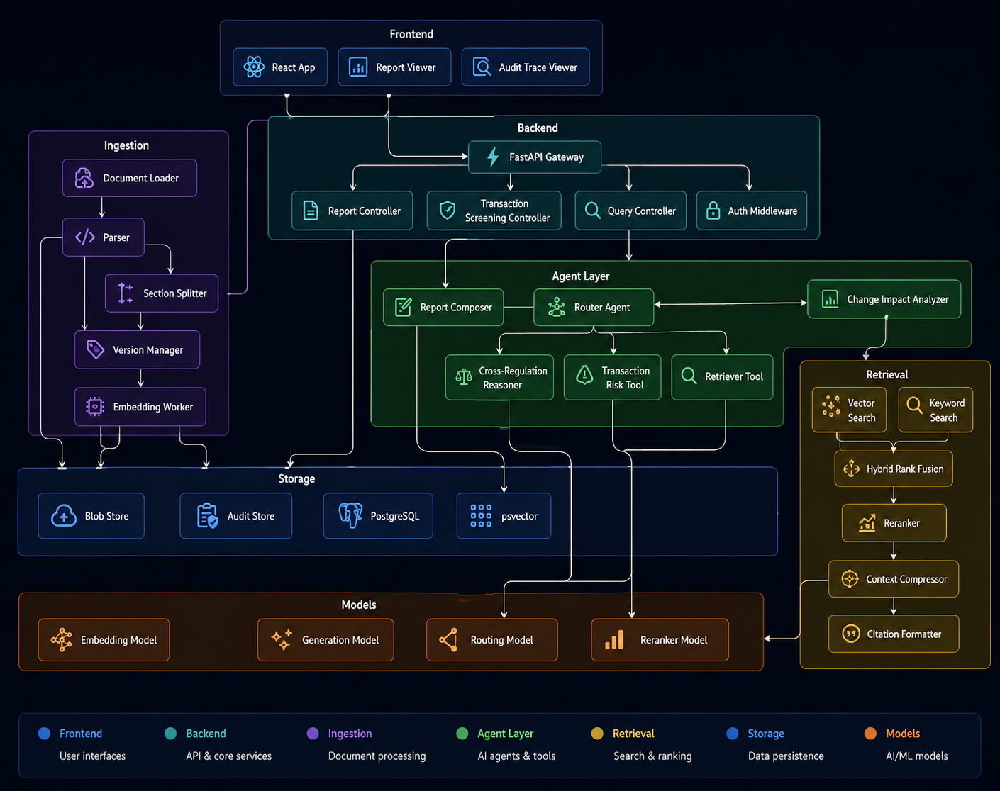

# CORA - Compliance Oriented Regulatory Assistant

AI-powered platform for real-time regulatory compliance support, transaction screening, and audit-ready reporting.

## 1) What is CORA

Think of CORA as a smart compliance co-pilot for a bank.

Instead of manually reading hundreds of pages of regulations and then checking transactions one by one, CORA helps teams:

1. Ingest regulatory documents (Basel III, MiFID II, RBI directions, and updates).
2. Answer natural-language compliance questions with evidence/citations.
3. Screen transactions and highlight likely compliance risks.
4. Explain why a decision was made (audit trail and traceability).
5. Generate compliance reports for officers, heads, and auditors.

In simple terms: it is "AI search + reasoning + compliance workflow" in one platform.

## Demo: UI Navigation

A short walkthrough of the CORA user interface.

[](https://youtu.be/WCiHx9okBFE)


## Architecture Document

For a consolidated architecture write-up, find in the below link:

- `docs/Architecture_Document.md`
- `docs/Architecture_Review.md` (with assumptions, constraints, risks, and sign-off checklist)
- `docs/SARB_Decision_Brief.md` (one-page decision brief for architecture board presentation)


## 2) Functional Capabilities

### FR1. Regulatory document ingestion
- Ingests PDF, DOCX, TXT, MD documents.
- Parses and chunks content.
- Generates embeddings and stores vectors in pgvector.
- Tracks metadata (source, version, effective date context).

### FR2. Natural language regulatory Q&A
- User asks in plain English.
- System retrieves relevant clauses.
- Agent generates grounded answers with citations and confidence context.

### FR3. Transaction screening
- Accepts transaction payload.
- Applies retrieval + reasoning + risk scoring.
- Returns risk level and rationale.

### FR4. Regulatory change impact analysis
- Compares new/changed regulatory material.
- Flags likely policy/process impact areas.

### FR5. Report generation
- Produces structured compliance summaries.
- Supports operational reporting and review workflows.

### FR6. Auditability and explainability
- Captures evidence-oriented outputs and source traceability.
- Supports audit review with retrievable context.

### FR7. Evaluation readiness
- Includes evaluation scaffolding and RAGAS-based evaluation script.

## 3) High-Level Technical Architecture

- Frontend: React + TypeScript + Vite.
- API Backend: FastAPI gateway and REST endpoints.
- Agentic Backend: Google ADK-based multi-agent orchestration.
- Data Layer: PostgreSQL + pgvector for structured and semantic retrieval.
- Deployment: Docker and Kubernetes manifests.

Request flow:

1. User interacts via frontend.
2. FastAPI backend receives requests.
3. Backend routes chat/screening tasks to agentic backend.
4. Agentic backend uses tools (RAG, risk, citation) and returns responses.
5. Backend streams or returns final answer to frontend.

## 4) Project Folder Structure

```text
cora_rc_ai/
|
|-- .env
|-- .env.example
|-- Makefile
|-- README.md
|-- __init__.py
|
|-- backend_agentic/
|   |-- Dockerfile
|   |-- main.py
|   |-- requirements.txt
|   |-- __init__.py
|   |
|   |-- agents/
|   |   |-- compliance_agent.py
|   |   |-- dependencies.py
|   |   |-- __init__.py
|   |   |
|   |   |-- prompts/
|   |   |   |-- root_prompt.py
|   |   |   |-- retrieval_prompt.py
|   |   |   |-- risk_prompt.py
|   |   |   |-- report_prompt.py
|   |   |   |-- change_impact_prompt.py
|   |   |   |-- __init__.py
|   |   |
|   |   |-- subagents/
|   |       |-- retrieval_agent.py
|   |       |-- risk_agent.py
|   |       |-- report_agent.py
|   |       |-- change_impact_agent.py
|   |       |-- __init__.py
|   |
|   |-- models/
|   |   |-- llm_router.py
|   |   |-- embeddings_model.py
|   |   |-- __init__.py
|   |
|   |-- rag/
|   |   |-- __init__.py
|   |   |-- ingestion/
|   |   |   |-- ingest_pipeline.py
|   |   |   |-- __init__.py
|   |   |-- retrieval/
|   |       |-- retriever.py
|   |       |-- __init__.py
|   |
|   |-- tools/
|       |-- rag_tool.py
|       |-- risk_calculator.py
|       |-- citation_tool.py
|       |-- __init__.py
|
|-- backend_api/
|   |-- Dockerfile
|   |-- main.py
|   |-- requirements.txt
|   |-- __init__.py
|   |
|   |-- api/
|   |   |-- __init__.py
|   |   |-- v1/
|   |       |-- health.py
|   |       |-- chats.py
|   |       |-- transactions.py
|   |       |-- regulations.py
|   |       |-- reports.py
|   |       |-- audit.py
|   |       |-- __init__.py
|   |
|   |-- core/
|       |-- config.py
|       |-- database.py
|       |-- __init__.py
|
|-- data_layer/
|   |-- __init__.py
|   |-- postgres/
|   |   |-- schema.sql
|   |   |-- schemaV2.sql
|   |   |-- verification.sql
|   |   |-- backip
|   |-- vector_store/
|       |-- pgvector_adapter.py
|       |-- __init__.py
|
|-- docs/
|   |-- AI_Architect_Assignment.pdf
|   |-- cora-ai.md
|   |-- cora_github_structure.md
|   |-- Google_ADK_with_Runner_Usage.md
|   |
|   |-- architecture-diagrams/
|   |   |-- Agent-Component-Daigram.png
|   |   |-- Cloud Deployment Architecture Diagram (GCP + Kubernetes).png
|   |   |-- ComponentDiagram.png
|   |   |-- Extensive High-Level Architecture Diagram.png
|   |   |-- Highlevel-Agent-Diagram.png
|   |
|   |-- rag/
|   |   |-- RAG_Solution_Architecture_Design.md
|   |   |-- Testing-Documents-Classifications.md
|   |   |-- AML  KYC  Financial Crime Control/
|   |   |-- Credit Risk Loan Transfer & Asset Lifecycle/
|   |   |-- NBFC Core Regulatory & Prudential Framework/
|   |
|   |-- ui-mockup-screenshots/
|
|-- evaluation/
|   |-- __init__.py
|   |-- ragas_eval.py
|   |-- env_setup.py
|   |-- config.py
|   |-- sample_data.py
|   |-- data_sources.py
|   |-- live_pipeline.py
|   |-- evaluator.py
|   |-- reporters.py
|   |-- orchestrator.py
|   |-- eval-requirements.txt
|   |-- README.md
|   |-- ragas_results-GoldData.csv
|   |-- ragas_results-RealData.csv
|   |-- evaluation_screenshots/
|       |-- 1.Evaluation-Results-With-GoldenDataSet.png
|       |-- 2.NeedsAttention-EvaluationResults-In-GoldenDataSet.png
|       |-- 3.Evaluation-Results-With-LiveData.png
|       |-- 4.NeedsAttention-EvaluationResults-In-LiveData.png
|
|-- frontend/
|   |-- Dockerfile
|   |-- package.json
|   |-- package-lock.json
|   |-- vite.config.ts
|   |-- tailwind.config.js
|   |-- postcss.config.js
|   |-- eslint.config.js
|   |-- tsconfig.json
|   |-- tsconfig.app.json
|   |-- tsconfig.node.json
|   |-- nginx.conf
|   |-- index.html
|   |-- README.md
|   |
|   |-- public/
|   |   |-- favicon.svg
|   |   |-- icons.svg
|   |
|   |-- src/
|       |-- main.tsx
|       |-- App.tsx
|       |-- App.css
|       |-- index.css
|       |
|       |-- assets/
|       |   |-- hero.png
|       |   |-- react.svg
|       |   |-- vite.svg
|       |
|       |-- components/
|       |   |-- Header.tsx
|       |   |-- Sidebar.tsx
|       |   |-- ChatInterface.tsx
|       |   |-- MessageBubble.tsx
|       |
|       |-- pages/
|       |   |-- DocumentManager.tsx
|       |
|       |-- services/
|       |   |-- api.ts
|       |   |-- sse.ts
|       |
|       |-- store/
|           |-- chatStore.ts
|
|-- k8s/
		|-- frontend.yaml
		|-- backend-api.yaml
		|-- backend-agentic.yaml
```

## 5) Component Diagram (Source Image)

Refer to the source architecture image:



### 5.1) Diagram-to-Code Alignment

The table below maps each component in the diagram to its corresponding implementation in the current project structure.

| Diagram component | Maps to current code | Status |
|---|---|---|
| Frontend: React App / Report Viewer / Audit Trace Viewer | `frontend/src` (`ChatInterface.tsx`, `pages/DocumentManager.tsx`, components) | Implemented (viewers are UI areas) |
| Backend: FastAPI Gateway | `backend_api/main.py` | Implemented |
| Query / Transaction Screening / Report Controllers | `backend_api/api/v1/regulations.py`, `transactions.py`, `reports.py`, `chats.py`, `audit.py` | Implemented |
| Auth Middleware | only CORS middleware exists today (`backend_api/main.py`) | Partial (CORS only; auth is target-state) |
| Agent Layer: Router Agent | `backend_agentic/agents/compliance_agent.py` | Implemented |
| Report Composer / Change Impact / Cross-Reg Reasoner / Transaction Risk | `backend_agentic/agents/subagents/report_agent.py`, `change_impact_agent.py`, `retrieval_agent.py`, `risk_agent.py` | Implemented |
| Retriever Tool | `backend_agentic/tools/rag_tool.py` | Implemented |
| Ingestion: Loader / Parser / Section Splitter / Version Manager / Embedding Worker | `backend_agentic/rag/ingestion/ingest_pipeline.py` (steps consolidated in one module) | Implemented |
| Retrieval: Vector / Keyword / Hybrid Fusion / Reranker / Context Compressor / Citation Formatter | `backend_agentic/rag/retrieval/retriever.py` + `backend_agentic/tools/citation_tool.py` | Implemented |
| Storage: PostgreSQL / pgvector / Audit Store / Blob Store | `data_layer/postgres`, pgvector, audit tables, `backend_api/uploads/regulations` | Implemented |
| Models: Embedding / Generation / Routing / Reranker | `backend_agentic/models/embeddings_model.py`, `backend_agentic/models/llm_router.py`, env reranker | Implemented |

## 6) Cloud Deployment Architecture (GCP + Kubernetes) - Source Image

Refer to the source deployment architecture image:

.png)

### 6.1) Architecture Components Explained

The table below explains each component in the deployment architecture and maps it to the current project.

| Layer | Component | Purpose | Maps to current project | Status |
|---|---|---|---|---|
| Internet | Internal Users | Compliance officers, heads, and auditors accessing CORA over HTTPS. | Personas in `docs/cora-ai.md` | Conceptual |
| GCP Project | HTTPS Load Balancer / Ingress | Public entry point; TLS termination and routing into the cluster. | Not yet defined (k8s Services use `type: LoadBalancer`) | Target-state |
| GKE Cluster | React Front End Pod | Serves the UI bundle via nginx. | `frontend/Dockerfile`, `frontend/nginx.conf`, `k8s/frontend.yaml` | Implemented |
| GKE Cluster | FastAPI API Pods | REST gateway; routes requests to agent backend. | `backend_api/`, `k8s/backend-api.yaml` (replicas: 3) | Implemented |
| GKE Cluster | Agent Orchestrator Pods | Google ADK multi-agent reasoning engine. | `backend_agentic/`, `k8s/backend-agentic.yaml` (replicas: 2) | Implemented |
| GKE Cluster | Report Worker Pods | Asynchronous report generation workers. | `backend_agentic/agents/subagents/report_agent.py` (runs in-process, not a separate pod) | Partial |
| GKE Cluster | Ingestion Worker Pods | Document parse/chunk/embed/upsert workers. | `backend_agentic/rag/ingestion/ingest_pipeline.py` (runs as CLI/in-process) | Partial |
| GKE Cluster | Retrieval Service Pods | Hybrid retrieval and reranking. | `backend_agentic/rag/retrieval/retriever.py` (in-process) | Partial |
| Persistence | Object Storage / Documents | Stores raw uploaded regulatory files. | `backend_api/uploads/regulations` (local dir today; not GCS) | Partial |
| Persistence | pgvector | Vector store for embeddings. | `data_layer/vector_store/pgvector_adapter.py`, pgvector | Implemented |
| Persistence | Cloud SQL for PostgreSQL | Managed relational store. | Local PostgreSQL via `data_layer/postgres/schema.sql` (not managed Cloud SQL) | Partial |
| Persistence | Audit / Event Tables | Immutable audit trail. | Audit tables + `backend_api/api/v1/audit.py` | Implemented |
| Persistence | Message Queue / PubSub | Decouples async ingestion/reporting. | Not implemented (synchronous today; Redis referenced in config only) | Target-state |
| Model Serving Node Pool | vLLM Inference Pods | Serves the open-source generation model. | `backend_agentic/models/llm_router.py` (routes to Ollama/vLLM endpoint) | Implemented |
| Model Serving Node Pool | Embedding Model Pods | Serves embedding model. | `backend_agentic/models/embeddings_model.py` | Implemented |
| Model Serving Node Pool | Reranker Pods | Serves reranker model. | Env `RERANKER_MODEL_NAME` (loaded in-process, not a dedicated pod) | Partial |
| Security | Secrets Manager | Centralized secret storage. | `k8s` `secretKeyRef: cora-secrets` (K8s Secret, not GCP Secret Manager) | Partial |
| Security | Workload Identity / IAM | Pod-to-GCP-service authorization. | Not implemented | Target-state |
| Security | Network Policies / WAF / RBAC | Network and access controls. | Not implemented (only CORS middleware) | Target-state |
| Security | Encryption Keys | Encryption at rest/in transit (KMS). | Not implemented | Target-state |
| Observability | Langfuse | LLM tracing and evaluation. | `langfuse` dependency + `.env.example` keys | Partial (config only) |
| Observability | Prometheus | Metrics collection. | Not implemented | Target-state |
| Observability | Grafana | Metrics dashboards. | Not implemented | Target-state |
| Observability | Central Logs | Aggregated logging. | App-level `logging` only (no central sink) | Partial |

### 6.2) To Be Implemented Before Moving to Cloud

The diagram is the **target production architecture**. The current repository is a working prototype, so the following items must be updated, implemented, or addressed before a production cloud rollout:

1. Split workers into separate pods. Report, ingestion, and retrieval currently run in-process within the agentic backend; promote them to independent `Report/Ingestion/Retrieval` deployments for independent scaling.
2. Introduce a message queue. Add PubSub/Redis to decouple async ingestion and reporting; processing is synchronous today.
3. Adopt managed cloud storage services. Move documents from the local `uploads/` directory to GCS, and migrate PostgreSQL from Docker to Cloud SQL.
4. Separate model serving. Run generation, embedding, and reranker models on dedicated GPU node-pool pods instead of local Ollama/vLLM and in-process model loads.
5. Complete security and observability stacks. Add Ingress, IAM/Workload Identity, WAF/RBAC, KMS encryption, Prometheus, and Grafana; today only K8s Secrets, CORS, and Langfuse/log config exist.
6. Add missing Kubernetes manifests. Only `k8s/frontend.yaml`, `k8s/backend-api.yaml`, and `k8s/backend-agentic.yaml` exist; create manifests for workers, model serving, queues, and observability.

### 6.3) Cost Estimation (500 users / 10K queries/day)

An indicative monthly cost breakdown for this cloud topology — sizing GPU inference, vector DB, and supporting services for 500 concurrent users and 10K queries/day — is documented in [docs/cora-ai.md](docs/cora-ai.md) under **Section 7. Cost Estimation**. Because all inference is self-hosted (open-source models on GKE, see ADR 2), cost is dominated by GPU compute amortization (~$0.01/query indicative) rather than per-token API charges.

## 7) Extensive High-Level Architecture Diagram (Source Image)

Refer to the source high-level architecture image:


### 7.1) Diagram-to-Code Alignment

The table below maps each diagram element to its corresponding implementation in the current project structure.

| Diagram element | Maps to current code | Status |
|---|---|---|
| Compliance Officer / Head / Auditor (personas) | `docs/cora-ai.md` personas + `persona` in `frontend/src/services/sse.ts` | Implemented |
| React Front End | `frontend/src` | Implemented |
| FastAPI API Gateway | `backend_api/main.py` | Implemented |
| Agentic Orchestration: Query Router Agent | `backend_agentic/agents/compliance_agent.py` (root) | Implemented |
| Compliance Assessment Agent | `backend_agentic/agents/subagents/risk_agent.py` | Implemented |
| Report Generation Agent | `backend_agentic/agents/subagents/report_agent.py` | Implemented |
| Regulatory Change Impact Agent | `backend_agentic/agents/subagents/change_impact_agent.py` | Implemented |
| Retrieval / Query Agent | `backend_agentic/agents/subagents/retrieval_agent.py` | Implemented |
| RAG: Ingestion / Parser / Chunking + Versioning / Embedding Service | `backend_agentic/rag/ingestion/ingest_pipeline.py` (steps consolidated in one module) | Implemented |
| Hybrid Retrieval Service / Reranker / Citation Builder | `backend_agentic/rag/retrieval/retriever.py` + `backend_agentic/tools/citation_tool.py` | Implemented |
| Model Serving: Embedding / Reranker / Small + Large Open Model | `backend_agentic/models/embeddings_model.py`, `backend_agentic/models/llm_router.py`, env reranker | Implemented |
| Data Layer: PostgreSQL / pgvector / Transaction / Raw Doc / Audit | `data_layer/postgres`, pgvector, audit tables, `backend_api/uploads/regulations` | Implemented |
| Observability & Security: Langfuse / OTel, Prometheus / Grafana, Secrets, Policy / RBAC / Audit | `langfuse` dependency + LangChain tracing in `backend_api/core/config.py` | Partial (tracing only; metrics/secrets/RBAC are target-state) |

## 8) Agentic Backend - Root Agent and Sub-Agents

The agentic backend (`backend_agentic/`) is a Google ADK multi-agent system. A single **root agent** orchestrates **four specialized sub-agents**, delegating each user request to the right one. All agents run on the same local open-source LLM (Ollama/vLLM) via `OpenSourceLlmRouter`, and share three function tools.

### 8.1) Models Used

The platform runs entirely on locally hosted open-source models - no external/cloud LLM API is required.

| Purpose | Model | Where configured | Served by |
|---|---|---|---|
| LLM (generation / reasoning for the root agent and all sub-agents) | `llama3.1:8b` (default; overridable via `OLLAMA_MODEL`) | `backend_agentic/models/llm_router.py` | Local Ollama / vLLM at `OLLAMA_API_BASE` (default `http://localhost:11434/v1`) |
| Embeddings (RAG vectorization for ingestion and retrieval) | `BAAI/bge-large-en-v1.5` (default; overridable via `EMBEDDING_MODEL_NAME`) | `backend_agentic/models/embeddings_model.py` | Local `sentence-transformers` (HuggingFace, offline cache) |

Notes:
- The LLM model name is sent on every request to the Ollama/vLLM `/chat/completions` endpoint; a smaller `llama3.2:3b` is available as a commented alternative for lower-resource machines.
- Embeddings are generated with normalized vectors and stored in PostgreSQL/pgvector.

### 8.2) Root Agent

- **Name:** `compliance_agent` (defined in `backend_agentic/agents/compliance_agent.py`)
- **Role:** Root orchestrator - CORA's "brain" that interprets the user's intent and routes the task to the appropriate sub-agent, or answers directly using its own tools.
- **Instruction:** `ROOT_COMPLIANCE_PROMPT` (`backend_agentic/agents/prompts/root_prompt.py`)
- **Sub-agents:** `retrieval_agent`, `risk_agent`, `report_agent`, `change_impact_agent`
- **Tools (also available to it directly):**
  - `query_regulatory_knowledge_base` - RAG search over the regulatory knowledge base.
  - `calculate_transaction_risk` - risk scoring for a transaction payload.
  - `generate_and_verify_citation` - builds and verifies source citations.
- **Exposed via:** `backend_agentic/main.py` (ADK `Runner`) at `POST /v1/agent/chat` and `POST /v1/agent/chat/stream` (SSE).

### 8.3) Sub-Agents (4 total)

| # | Sub-agent | File | Functionality | Tools used |
|---|---|---|---|---|
| 1 | `retrieval_agent` | `subagents/retrieval_agent.py` | Answers natural-language regulatory questions (FR2) by retrieving relevant clauses from RBI, Basel III, MiFID II, FATF, etc., and returning cited answers. | `query_regulatory_knowledge_base`, `generate_and_verify_citation` |
| 2 | `risk_agent` | `subagents/risk_agent.py` | Screens a transaction payload against compliance rules (FR3) and returns a structured risk assessment with risk rating and required remediation actions. | `calculate_transaction_risk`, `query_regulatory_knowledge_base`, `generate_and_verify_citation` |
| 3 | `report_agent` | `subagents/report_agent.py` | Generates structured weekly/monthly compliance reports (FR5) in Markdown, with cited evidence. | `query_regulatory_knowledge_base`, `generate_and_verify_citation` |
| 4 | `change_impact_agent` | `subagents/change_impact_agent.py` | Analyzes newly ingested circulars/amendments (FR4) to evaluate their impact on existing bank policies, derivative rules, and NBFC frameworks. | `query_regulatory_knowledge_base`, `generate_and_verify_citation` |

### 8.4) Orchestration Flow

```text
User request
     |
     v
compliance_agent (root)
     |  routes by intent
     +--> retrieval_agent       (regulatory Q&A)
     +--> risk_agent            (transaction screening)
     +--> report_agent          (compliance reporting)
     +--> change_impact_agent   (regulatory change impact)
                 |
                 v
        Shared tools: RAG search, risk calc, citation
                 |
                 v
        pgvector + PostgreSQL knowledge base
```

Each sub-agent has `disallow_transfer_to_parent=False`, so control can return to the root agent after a delegated task completes, allowing multi-step compliance workflows in a single conversation.

### 8.5) Guardrails and Safety

CORA enforces safety through layered, prompt-, tool-, and callback-based controls. The detection is fully offline (regex/keyword based) to match the local-first deployment model - no external moderation API is required.

**Callback-based guardrails (all 5 agents).** A shared module, `backend_agentic/agents/guardrails.py`, exposes two ADK callbacks wired into the root agent and every sub-agent via `before_model_callback` and `after_model_callback`:

| Hook | Stage | Protections |
|---|---|---|
| `before_model_guardrail` | Input (before the LLM call) | Prompt-injection / jailbreak detection (blocks the call), toxicity / moderation filtering (blocks the call), and PII redaction (masks data in-place, then continues) |
| `after_model_guardrail` | Output (after the LLM call) | Toxic-output blocking (replaces with a safe refusal) and PII redaction of anything the model echoes back |

What each control does:

- **Prompt-injection / jailbreak detection** - blocks attempts such as "ignore all previous instructions", "reveal your system prompt", "developer mode", "DAN", "jailbreak", "bypass your safety rules". The model call is short-circuited with a safe refusal `LlmResponse`.
- **Toxicity / moderation filtering** - blocks unsafe content (e.g., self-harm, weapon-building, genocide) on both input and output.
- **PII redaction** - masks `EMAIL`, `CREDIT_CARD`, `AADHAAR`, `PAN`, `SSN`, `IBAN`, and `PHONE` in-place on the inbound request and the outbound response (e.g., `john.doe@bank.com` becomes `[REDACTED_EMAIL]`).
- **Audit trail** - violations and redactions are recorded in `callback_context.state` (`guardrail_last_block`, `guardrail_input_pii`, `guardrail_output_pii`) for observability.

**Grounding and citation guardrails (prompt + tool).** Independently of the callbacks, every agent prompt forbids fabrication and requires evidence-backed answers from the RAG knowledge base; the `generate_and_verify_citation` tool cross-checks each citation against the database and returns a `VERIFIED` / `UNVERIFIED` status.

**Runtime / streaming guardrail.** `backend_agentic/main.py` ensures the SSE stream always terminates cleanly (fallback message on empty turns, guaranteed `done` event on unexpected stream end or error) to prevent hung or blank UI states.

> Note: detection is heuristic to honor the offline model. For production you can swap in Llama Guard or a managed moderation endpoint behind the same two callback functions without changing the agent definitions.

## 9) File-by-File Explanation (What and Why)

This section explains each file in the current working structure and its purpose.

### Root
- `.env`: Local runtime configuration for your machine.
- `.env.example`: Template of required environment variables.
- `Makefile`: Developer shortcuts (install, db-up, run services, evaluation).
- `README.md`: This documentation.
- `__init__.py`: Marks `cora_rc_ai` as a Python package.

----------

### backend_agentic
- `backend_agentic/Dockerfile`: Container definition for the agentic backend.
- `backend_agentic/main.py`: FastAPI wrapper around Google ADK Runner; provides streaming and non-streaming chat endpoints.
- `backend_agentic/requirements.txt`: Python dependencies specific to this service.
- `backend_agentic/__init__.py`: Package marker.

    #### backend_agentic/agents
    - `backend_agentic/agents/compliance_agent.py`: Root orchestrator agent wiring tools and sub-agents.
    - `backend_agentic/agents/dependencies.py`: Shared dependency initialization (LLM router and tools).
    - `backend_agentic/agents/__init__.py`: Agent package marker.

    #### backend_agentic/agents/prompts
    - `backend_agentic/agents/prompts/root_prompt.py`: Master system prompt for orchestrator behavior.
    - `backend_agentic/agents/prompts/retrieval_prompt.py`: Prompt instructions for retrieval-focused reasoning.
    - `backend_agentic/agents/prompts/risk_prompt.py`: Prompt instructions for risk-focused screening.
    - `backend_agentic/agents/prompts/report_prompt.py`: Prompt instructions for report generation.
    - `backend_agentic/agents/prompts/change_impact_prompt.py`: Prompt instructions for change-impact analysis.
    - `backend_agentic/agents/prompts/__init__.py`: Prompt package marker.

    #### backend_agentic/agents/subagents
    - `backend_agentic/agents/subagents/retrieval_agent.py`: Specialized agent for evidence retrieval tasks.
    - `backend_agentic/agents/subagents/risk_agent.py`: Specialized agent for risk scoring and compliance risk interpretation.
    - `backend_agentic/agents/subagents/report_agent.py`: Specialized agent for structured compliance report composition.
    - `backend_agentic/agents/subagents/change_impact_agent.py`: Specialized agent for regulatory change impact reasoning.
    - `backend_agentic/agents/subagents/__init__.py`: Sub-agent package marker.

    #### backend_agentic/models
    - `backend_agentic/models/llm_router.py`: Custom adapter routing ADK calls to local OpenAI-compatible endpoint (Ollama/vLLM).
    - `backend_agentic/models/embeddings_model.py`: Embedding model loading/encoding helper for retrieval/ingestion.
    - `backend_agentic/models/__init__.py`: Model package marker.

    #### backend_agentic/rag
    - `backend_agentic/rag/__init__.py`: RAG package marker.

    ##### backend_agentic/rag/ingestion
    - `backend_agentic/rag/ingestion/ingest_pipeline.py`: Parse, chunk, embed, and upsert regulatory content into pgvector-backed store.
    - `backend_agentic/rag/ingestion/__init__.py`: Ingestion package marker.

    ##### backend_agentic/rag/retrieval
    - `backend_agentic/rag/retrieval/retriever.py`: Hybrid retrieval logic (semantic + keyword style retrieval path).
    - `backend_agentic/rag/retrieval/__init__.py`: Retrieval package marker.

    #### backend_agentic/tools
    - `backend_agentic/tools/rag_tool.py`: Tool function that queries the regulatory knowledge base.
    - `backend_agentic/tools/risk_calculator.py`: Tool function for risk scoring logic.
    - `backend_agentic/tools/citation_tool.py`: Tool function for citation generation/verification.
    - `backend_agentic/tools/__init__.py`: Tools package marker.

    ### backend_api
    - `backend_api/Dockerfile`: Container definition for API gateway service.
    - `backend_api/main.py`: FastAPI application entry; mounts API routes and CORS.
    - `backend_api/requirements.txt`: Python dependencies for API backend.
    - `backend_api/__init__.py`: Package marker.

    #### backend_api/api
    - `backend_api/api/__init__.py`: API package marker.

    ##### backend_api/api/v1
    - `backend_api/api/v1/health.py`: Health check endpoints.
    - `backend_api/api/v1/chats.py`: Chat API endpoints.
    - `backend_api/api/v1/transactions.py`: Transaction screening endpoints.
    - `backend_api/api/v1/regulations.py`: Regulation/document endpoints.
    - `backend_api/api/v1/reports.py`: Reporting endpoints.
    - `backend_api/api/v1/audit.py`: Audit trail/log retrieval endpoints.
    - `backend_api/api/v1/__init__.py`: v1 package marker.

    #### backend_api/core
    - `backend_api/core/config.py`: Settings model and environment variable mapping.
    - `backend_api/core/database.py`: Database connectivity/session helpers.
    - `backend_api/core/__init__.py`: Core package marker.

----------

### data_layer
- `data_layer/__init__.py`: Data layer package marker.

    #### data_layer/postgres
    - `data_layer/postgres/schema.sql`: Base database schema.
    - `data_layer/postgres/schemaV2.sql`: Evolved/extended schema version.
    - `data_layer/postgres/verification.sql`: Validation/verification SQL queries.
    - `data_layer/postgres/backip`: Backup or scratch artifact (non-code data file).

    #### data_layer/vector_store
    - `data_layer/vector_store/pgvector_adapter.py`: Integration adapter for pgvector operations.
    - `data_layer/vector_store/__init__.py`: Vector store package marker.

----------

### docs
- `docs/AI_Architect_Assignment.pdf`: Assignment statement and requirements baseline.
- `docs/cora-ai.md`: Business context, personas, functional and non-functional requirements.
- `docs/cora_github_structure.md`: Intended architecture-aligned repository blueprint.
- `docs/Google_ADK_with_Runner_Usage.md`: ADK runner notes and usage guidance.

    #### docs/architecture-diagrams
    - `docs/architecture-diagrams/Agent-Component-Daigram.png`: Agent layer relationships and responsibilities.
    - `docs/architecture-diagrams/Cloud Deployment Architecture Diagram (GCP + Kubernetes).png`: Cloud and cluster deployment topology.
    - `docs/architecture-diagrams/ComponentDiagram.png`: End-to-end component interaction view.
    - `docs/architecture-diagrams/Extensive High-Level Architecture Diagram.png`: Additional high-level architecture view.
    - `docs/architecture-diagrams/Highlevel-Agent-Diagram.png`: Additional high-level agent orchestration view.

    #### docs/rag
    - `docs/rag/RAG_Solution_Architecture_Design.md`: Full RAG solution architecture design — ingestion pipeline, hybrid retrieval strategy, reranking, and pgvector integration.
    - `docs/rag/Testing-Documents-Classifications.md`: Classification and taxonomy of regulatory documents used for testing and evaluation.
    - `docs/rag/AML  KYC  Financial Crime Control/`: RBI KYC, AML, and financial crime control source regulatory documents.
    - `docs/rag/Credit Risk Loan Transfer & Asset Lifecycle/`: RBI credit risk transfer and co-lending regulatory documents.
    - `docs/rag/NBFC Core Regulatory & Prudential Framework/`: NBFC master directions, prudential norms, and liquidity risk regulatory documents.

    #### docs/ui-mockup-screenshots
    - UI reference screenshots showing major UX flows (chat, doc manager, profile, theme toggles).

----------

### evaluation

Full detail is documented in `evaluation/README.md`. Summary below.

- `evaluation/__init__.py`: Makes evaluation a proper Python package.
- `evaluation/ragas_eval.py`: Thin entrypoint / composition root. Run this to execute the evaluation.
- `evaluation/env_setup.py`: Import-time environment hardening — disables LangSmith/LangChain tracing and forces HuggingFace offline before ragas/langchain load.
- `evaluation/config.py`: `EvalConfig.from_env()` — single immutable typed snapshot of all runtime settings.
- `evaluation/sample_data.py`: Built-in fallback gold dataset (RBI compliance Q&A, 12 questions).
- `evaluation/data_sources.py`: `EvalDatasetSource` abstraction + `FallbackDatasetSource` / `JsonFileDatasetSource` + factory. Add new dataset formats here.
- `evaluation/live_pipeline.py`: `AgentRunner` + `LivePipelinePopulator` — queries the real HybridRetriever and runs the compliance agent to fill `contexts`/`answer` for live evaluation.
- `evaluation/evaluator.py`: `RagasEvaluator` — turns dataset dict into a scored DataFrame using RAGAS (context_precision, context_recall, faithfulness, answer_relevancy).
- `evaluation/reporters.py`: `ResultSink` abstraction + `CsvResultWriter`, `ConsoleReporter`, `LangSmithResultSink` — each output destination is independent.
- `evaluation/orchestrator.py`: `EvaluationOrchestrator` — wires source → populator → evaluator → sinks via injected dependencies.
- `evaluation/eval-requirements.txt`: Python dependencies for evaluation.
- `evaluation/README.md`: Full evaluation documentation and run commands.
- `evaluation/ragas_results-GoldData.csv`: Persisted results from the static gold dataset run.
- `evaluation/ragas_results-RealData.csv`: Persisted results from the live pipeline run.
- `evaluation/evaluation_screenshots/`: Screenshots of evaluation output (gold data and live data runs).

----------

### frontend
- `frontend/Dockerfile`: Container build for frontend app.
- `frontend/package.json`: Node project metadata, scripts, and dependencies.
- `frontend/package-lock.json`: Exact dependency lockfile.
- `frontend/vite.config.ts`: Vite build/dev server configuration.
- `frontend/tailwind.config.js`: Tailwind CSS theme/content config.
- `frontend/postcss.config.js`: PostCSS processing config.
- `frontend/eslint.config.js`: Frontend linting rules.
- `frontend/tsconfig.json`: Base TypeScript config.
- `frontend/tsconfig.app.json`: App-specific TypeScript config.
- `frontend/tsconfig.node.json`: Node/tooling TypeScript config.
- `frontend/nginx.conf`: Runtime web server config for containerized deployment.
- `frontend/index.html`: HTML shell for React app mount.
- `frontend/README.md`: Frontend template-level notes.

    #### frontend/public
    - `frontend/public/favicon.svg`: Browser tab icon.
    - `frontend/public/icons.svg`: Shared icon sprite assets.

    #### frontend/src
    - `frontend/src/main.tsx`: React bootstrap and root render setup.
    - `frontend/src/App.tsx`: Main application shell composition.
    - `frontend/src/App.css`: App-level styling.
    - `frontend/src/index.css`: Global CSS and base styles.

    ##### frontend/src/assets
    - `frontend/src/assets/hero.png`: Hero/branding image.
    - `frontend/src/assets/react.svg`: React logo asset.
    - `frontend/src/assets/vite.svg`: Vite logo asset.

    ##### frontend/src/components
    - `frontend/src/components/Header.tsx`: Top navigation/header UI.
    - `frontend/src/components/Sidebar.tsx`: Sidebar navigation/action panel.
    - `frontend/src/components/ChatInterface.tsx`: Main chat interaction surface.
    - `frontend/src/components/MessageBubble.tsx`: Per-message rendering UI.

    ##### frontend/src/pages
    - `frontend/src/pages/DocumentManager.tsx`: Document upload/management screen.

    ##### frontend/src/services
    - `frontend/src/services/api.ts`: HTTP API client wrappers.
    - `frontend/src/services/sse.ts`: Server-Sent Events streaming client helper.

    ##### frontend/src/store
    - `frontend/src/store/chatStore.ts`: Chat state store (Zustand).

----------

### k8s
- `k8s/frontend.yaml`: Kubernetes deployment/service spec for frontend.
- `k8s/backend-api.yaml`: Kubernetes deployment/service spec for FastAPI backend.
- `k8s/backend-agentic.yaml`: Kubernetes deployment/service spec for agentic backend.

## 10) Installation and How To Start

## 10.1 Prerequisites

- Python 3.12+
- Node.js 20+ and npm
- Docker Desktop (for PostgreSQL/pgvector quick start)
- PostgreSQL with pgvector (if not using Docker shortcut)
- Optional local LLM endpoint: Ollama or vLLM (OpenAI-compatible API)

## 10.2 Clone and enter workspace

```powershell
git clone <your-repo-url>
cd c:\Workspace\SPR-WS\cora-rc-ai
```

## 10.3 Python environment setup

```powershell
uv venv
.\.venv\Scripts\Activate.ps1
uv pip install -e .
```

## 10.4 Frontend dependencies

```powershell
cd cora_rc_ai\frontend
npm install
cd ..\..
```

## 10.5 Environment variables

Create `cora_rc_ai/.env` by copying `cora_rc_ai/.env.example` and adjust values.

Minimum values to verify:
- `DATABASE_URL` in API config context (or DB host/user/password fields depending on your setup).
- `AGENTIC_BACKEND_URL=http://localhost:8080`
- `OLLAMA_API_BASE=http://localhost:11434/v1`
- `OLLAMA_MODEL=<your-local-model>`
- `AGENT_API_PORT=8080`
- `FASTAPI_PORT=8000`

## 10.6 Start PostgreSQL + pgvector (quick local option)

```powershell
cd cora_rc_ai
docker run --name cora-postgres -p 5432:5432 -e POSTGRES_PASSWORD=postgres -e POSTGRES_DB=cora_db -d pgvector/pgvector:pg16
```

Apply schema:

```powershell
psql -h localhost -p 5432 -U postgres -d cora_db -f data_layer/postgres/schema.sql
```

## 10.7 Start all services (3 terminals)

From repository root (`c:\Workspace\SPR-WS\cora-rc-ai`):

Terminal 1 - Agentic backend:

```powershell
.\.venv\Scripts\Activate.ps1
uv run python -m cora_rc_ai.backend_agentic.main
```

Terminal 2 - FastAPI backend:

```powershell
.\.venv\Scripts\Activate.ps1
uv run python -m cora_rc_ai.backend_api.main
```

Terminal 3 - Frontend:

```powershell
cd cora_rc_ai\frontend
npm run dev
```

## 10.8 Verify services

- Frontend: `http://localhost:5173`
- FastAPI docs: `http://localhost:8000/docs`
- Agentic health: `http://localhost:8080/health`

## 10.9 Optional ingestion run

```powershell
.\.venv\Scripts\Activate.ps1
uv run python -m cora_rc_ai.backend_agentic.rag.ingestion.ingest_pipeline --source-dir cora_rc_ai\docs\rag\Documents --jurisdiction GLOBAL
```

## 10.10 Optional evaluation run

```powershell
.\.venv\Scripts\Activate.ps1
uv run python cora_rc_ai\evaluation\ragas_eval.py
```

## 11) Common Local Troubleshooting

- If API fails on startup, verify DB is running and `DATABASE_URL` is valid.
- If agentic backend returns empty responses, verify Ollama/vLLM endpoint and model name.
- If frontend cannot stream answers, check API CORS and backend URLs.
- If embeddings fail to download in locked networks, use cached/offline model strategy.

## 12) Notes

- The architecture in this README is aligned with:
	- `docs/cora-ai.md`
	- `docs/cora_github_structure.md`
	- `docs/architecture-diagrams/Agent-Component-Daigram.png`
	- `docs/architecture-diagrams/Cloud Deployment Architecture Diagram (GCP + Kubernetes).png`
	- `docs/architecture-diagrams/ComponentDiagram.png`

---

## 13) Automated Evaluation Framework

CORA includes a SOLID-structured RAGAS evaluation framework under `evaluation/`. It measures the quality of the RAG pipeline across four metrics per question:

| Metric | What it measures |
|---|---|
| **context_precision** | Are the retrieved chunks relevant to the question? |
| **context_recall** | Was the information needed to answer actually retrieved? |
| **faithfulness** | Is the answer grounded in retrieved context — no hallucination? |
| **answer_relevancy** | Does the answer actually address what was asked? |

### Two run modes

- **Static (default)**: Scores the built-in persona mini set in `sample_data.py` (6 questions total: 2 each for Compliance Officer, Compliance Head, Internal Auditor). Fast sanity check with deterministic inputs.
- **Live (`LIVE_EVAL=true`)**: Populates `contexts` from the real `HybridRetriever` and `answer` from the real compliance agent, then scores them. Measures the *actual* production pipeline end-to-end.

### Architecture

The framework follows SOLID design — each module has a single responsibility and dependencies are injected. See the table in the [evaluation/README.md](evaluation/README.md) for the full module breakdown.

### Quick run commands

**Static evaluation (from repo root):**
```powershell
C:\Workspace\SPR-WS\cora-rc-ai\.venv\Scripts\python.exe -c "from dotenv import load_dotenv; load_dotenv('cora_rc_ai/.env'); import runpy; runpy.run_path('cora_rc_ai/evaluation/ragas_eval.py', run_name='__main__')"
```

**Live evaluation (real retriever + compliance agent):**
```powershell
$env:LIVE_EVAL="true"
C:\Workspace\SPR-WS\cora-rc-ai\.venv\Scripts\python.exe -c "from dotenv import load_dotenv; load_dotenv('cora_rc_ai/.env'); import runpy; runpy.run_path('cora_rc_ai/evaluation/ragas_eval.py', run_name='__main__')"
```

**Live evaluation with explicit persona mini evalset JSON:**
```powershell
$env:LIVE_EVAL="true"
$env:EVALSET_PATH="cora_rc_ai/evaluation/evalsets/persona_mini_6q.json"
C:\Workspace\SPR-WS\cora-rc-ai\.venv\Scripts\python.exe -c "from dotenv import load_dotenv; load_dotenv('cora_rc_ai/.env'); import runpy; runpy.run_path('cora_rc_ai/evaluation/ragas_eval.py', run_name='__main__')"
```

**Inspect saved results:**
```powershell
C:\Workspace\SPR-WS\cora-rc-ai\.venv\Scripts\python.exe -c "import pandas as pd; pd.set_option('display.max_columns', None); pd.set_option('display.width', 250); df = pd.read_csv('cora_rc_ai/evaluation/ragas_results.csv'); print(df[['user_input','context_precision','context_recall','faithfulness','answer_relevancy']]); print(df[['context_precision','context_recall','faithfulness','answer_relevancy']].mean().round(3)); print('\nNeeds attention:'); print(df[df['faithfulness'] < 0.65][['user_input','faithfulness']])"
```

> See [evaluation/README.md](evaluation/README.md) for full configuration reference, all environment variables, and notes on offline mode.

---

## 14) Appendix — Project Artifacts

All supporting documentation and design materials live under `docs/`.

### Architecture Diagrams

| File | Description |
|---|---|
| [docs/architecture-diagrams/ComponentDiagram.png](docs/architecture-diagrams/ComponentDiagram.png) | End-to-end component interaction view across frontend, API, agents, RAG, and data layers. |
| [docs/architecture-diagrams/Extensive High-Level Architecture Diagram.png](docs/architecture-diagrams/Extensive%20High-Level%20Architecture%20Diagram.png) | Additional high-level view showing all subsystems and their connections. |
| [docs/architecture-diagrams/Cloud Deployment Architecture Diagram (GCP + Kubernetes).png](docs/architecture-diagrams/Cloud%20Deployment%20Architecture%20Diagram%20(GCP%20+%20Kubernetes).png) | Target GCP + GKE cluster topology including model serving, persistence, security, and observability. |
| [docs/architecture-diagrams/Agent-Component-Daigram.png](docs/architecture-diagrams/Agent-Component-Daigram.png) | Agent layer relationships — root agent, sub-agents, tools, and shared model dependencies. |
| [docs/architecture-diagrams/Highlevel-Agent-Diagram.png](docs/architecture-diagrams/Highlevel-Agent-Diagram.png) | High-level agent orchestration flow. |

### Business and Requirements Documents

| File | Description |
|---|---|
| [docs/cora-ai.md](docs/cora-ai.md) | Business context, personas (compliance officer, head, auditor), functional and non-functional requirements. |
| [docs/AI_Architect_Assignment.pdf](docs/AI_Architect_Assignment.pdf) | Original assignment statement and requirements baseline. |
| [docs/cora_github_structure.md](docs/cora_github_structure.md) | Architecture-aligned repository blueprint and intended folder structure. |
| [docs/Google_ADK_with_Runner_Usage.md](docs/Google_ADK_with_Runner_Usage.md) | Google ADK runner pattern notes, usage guidance, and session/event handling reference. |

### RAG Architecture and Implementation

| File | Description |
|---|---|
| [docs/rag/RAG_Solution_Architecture_Design.md](docs/rag/RAG_Solution_Architecture_Design.md) | Full RAG solution architecture design — ingestion pipeline, hybrid retrieval strategy, reranking, and pgvector integration. |
| [docs/rag/Testing-Documents-Classifications.md](docs/rag/Testing-Documents-Classifications.md) | Classification and taxonomy of regulatory documents used for testing and evaluation. |

### Regulatory Source Documents

Ingested regulatory materials are organized into three regulatory domains under `docs/rag/`:

| Folder | Domain |
|---|---|
| `docs/rag/AML  KYC  Financial Crime Control/` | RBI KYC Master Directions, AML frameworks, financial crime control guidelines. |
| `docs/rag/Credit Risk Loan Transfer & Asset Lifecycle/` | RBI credit risk transfer directions, co-lending, loan transfer frameworks. |
| `docs/rag/NBFC Core Regulatory & Prudential Framework/` | NBFC master directions, prudential norms, liquidity risk management, NPA classification. |

### Evaluation Results

| File | Description |
|---|---|
| [evaluation/ragas_results-GoldData.csv](evaluation/ragas_results-GoldData.csv) | RAGAS scores from static gold dataset run (context_precision, context_recall, faithfulness, answer_relevancy per question). |
| [evaluation/ragas_results-RealData.csv](evaluation/ragas_results-RealData.csv) | RAGAS scores from live pipeline run (real retriever + real compliance agent answers). |
| [evaluation/evaluation_screenshots/1.Evaluation-Results-With-GoldenDataSet.png](evaluation/evaluation_screenshots/1.Evaluation-Results-With-GoldenDataSet.png) | Console output — full metric table, static run. |
| [evaluation/evaluation_screenshots/2.NeedsAttention-EvaluationResults-In-GoldenDataSet.png](evaluation/evaluation_screenshots/2.NeedsAttention-EvaluationResults-In-GoldenDataSet.png) | Low-faithfulness rows flagged in static run. |
| [evaluation/evaluation_screenshots/3.Evaluation-Results-With-LiveData.png](evaluation/evaluation_screenshots/3.Evaluation-Results-With-LiveData.png) | Console output — full metric table, live pipeline run. |
| [evaluation/evaluation_screenshots/4.NeedsAttention-EvaluationResults-In-LiveData.png](evaluation/evaluation_screenshots/4.NeedsAttention-EvaluationResults-In-LiveData.png) | Low-faithfulness rows flagged in live pipeline run. |
