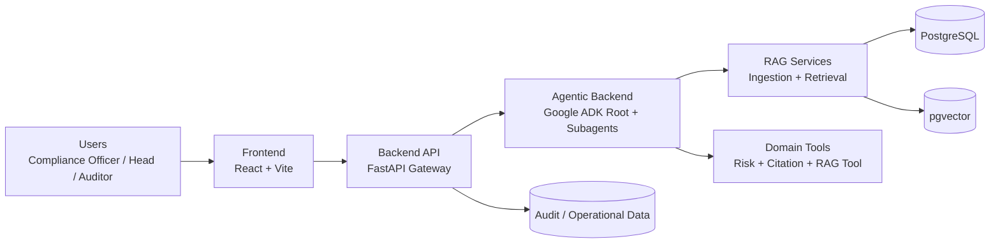
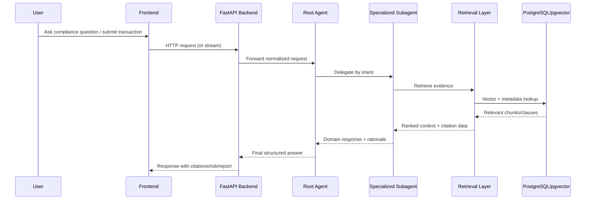

# CORA Architecture Document

Version: 1.0  
Date: 2026-06-10  
System: CORA (Compliance Oriented Regulatory Assistant)

## 1. Purpose and Scope

This document describes the current architecture of CORA and the target production direction.
It covers:

- Business-aligned functional architecture
- Runtime components and interaction flows
- Data architecture and storage model
- Deployment architecture (container and Kubernetes)
- Security, observability, and scalability considerations
- Implementation status (implemented, partial, target-state)

## 2. System Overview

CORA is an AI-powered compliance platform for financial institutions. It helps teams ingest regulatory content, answer compliance questions with citations, screen transactions, analyze regulatory changes, and generate audit-ready reports.

Primary users:

- Compliance Officer
- Compliance Head
- Internal Auditor

## 3. Functional Architecture

Core capabilities:

- FR1: Regulatory document ingestion (PDF, DOCX, TXT, MD)
- FR2: Natural-language Q&A with evidence and citations
- FR3: Transaction screening and risk assessment
- FR4: Regulatory change impact analysis
- FR5: Structured report generation
- FR6: Auditability and explainability
- FR7: Evaluation readiness (RAGAS and test datasets)

## 4. Logical Architecture

## 5. Component Architecture

### 5.1 Frontend

Location: `frontend/`

Responsibilities:

- User interaction for chat and compliance workflows
- API integration for request/response and streaming
- UI state management and workflow screens

Technology:

- React
- TypeScript
- Vite
- TailwindCSS

### 5.2 Backend API

Location: `backend_api/`

Responsibilities:

- External API boundary and routing
- Health and domain endpoints
- Request validation and response shaping
- Integration bridge to agentic backend

Representative API modules:

- `api/v1/chats.py`
- `api/v1/transactions.py`
- `api/v1/regulations.py`
- `api/v1/reports.py`
- `api/v1/audit.py`

### 5.3 Agentic Backend

Location: `backend_agentic/`

Responsibilities:

- Multi-agent orchestration for domain tasks
- Intent routing and specialized reasoning
- Tool orchestration for retrieval, citation, and risk

Agent layout:

- Root agent: `agents/compliance_agent.py`
- Subagents:
  - `agents/subagents/retrieval_agent.py`
  - `agents/subagents/risk_agent.py`
  - `agents/subagents/report_agent.py`
  - `agents/subagents/change_impact_agent.py`

### 5.4 RAG and Model Layer

RAG locations:

- Ingestion: `backend_agentic/rag/ingestion/`
- Retrieval: `backend_agentic/rag/retrieval/`

Model locations:

- LLM routing: `backend_agentic/models/llm_router.py`
- Embeddings: `backend_agentic/models/embeddings_model.py`

Tooling:

- `backend_agentic/tools/rag_tool.py`
- `backend_agentic/tools/citation_tool.py`
- `backend_agentic/tools/risk_calculator.py`

### 5.5 Data Layer

Location: `data_layer/`

Responsibilities:

- Relational persistence (PostgreSQL)
- Semantic retrieval index (pgvector)
- Schema evolution and verification scripts

Representative files:

- `data_layer/postgres/schema.sql`
- `data_layer/postgres/schemaV2.sql`
- `data_layer/vector_store/pgvector_adapter.py`

## 6. Agent Orchestration Flow

## 7. Deployment Architecture

Current deployment assets:

- Dockerfiles:
  - `frontend/Dockerfile`
  - `backend_api/Dockerfile`
  - `backend_agentic/Dockerfile`
- Kubernetes manifests:
  - `k8s/frontend.yaml`
  - `k8s/backend-api.yaml`
  - `k8s/backend-agentic.yaml`

Current state summary:

- Three deployable services are containerized
- Baseline Kubernetes manifests exist
- Some worker and platform capabilities are still in-process or not yet externalized

Target-state direction:

- Separate ingestion/report/retrieval workers for independent scaling
- Managed cloud storage and managed PostgreSQL
- Queue-based async processing
- Dedicated model-serving workloads
- Full observability and security hardening stack

## 8. Data Architecture

Data classes:

- Regulatory source documents
- Parsed and chunked regulatory text
- Embeddings and vector index entries
- Transaction screening payloads and outputs
- Generated reports
- Audit traces and evidence records

Storage mapping:

- Structured/audit data: PostgreSQL
- Semantic search vectors: pgvector
- Uploaded source files: local uploads directory (current)

## 9. Security Architecture

Current implementation:

- Service-level configuration and environment-based secrets usage
- CORS middleware at API boundary
- Basic operational logging

Recommended production controls:

- Strong authentication and authorization (RBAC)
- Secret manager integration
- Workload identity and least-privilege IAM
- Encryption policy (in transit and at rest)
- Network policies and ingress hardening
- Immutable audit/event retention policy

## 10. Observability Architecture

Current implementation:

- Application logging
- Langfuse-related configuration present

Recommended production controls:

- Structured logs with centralized collection
- Metrics (request, latency, model, retrieval, queue)
- Tracing across API, agents, tools, and data calls
- Dashboards and alerting for SLOs

## 11. Quality and Evaluation

Evaluation module location: `evaluation/`

Capabilities:

- RAGAS-based evaluation scripts
- Data sources and orchestration for test runs
- Result artifacts for comparative analysis

Suggested quality gates:

- Groundedness and citation correctness
- Retrieval precision/recall and context relevance
- Hallucination and refusal behavior checks
- Performance baselines (P95 latency, throughput)
- Regression checks for prompt and model updates

## 12. Architecture Decisions (Current)

1. Multi-service architecture with clear boundaries between UI, API, and agentic runtime.
2. ADK-based root-plus-subagent pattern for domain task specialization.
3. RAG-backed reasoning with citation-first response style.
4. PostgreSQL + pgvector as a unified storage strategy for transactional and semantic retrieval needs.
5. Container-first deployment design with Kubernetes manifests for service orchestration.

## 13. Known Gaps and Roadmap

Near-term improvements:

1. Externalize asynchronous worker paths (ingestion and reporting).
2. Introduce queue-backed job orchestration.
3. Add authentication and fine-grained authorization.
4. Harden deployment with centralized observability.
5. Define SLOs and automated regression/evaluation pipelines.

## 14. Traceability to Repository

Primary architecture sources in repository:

- `README.md`
- `docs/cora-ai.md`
- `docs/cora_github_structure.md`
- `docs/rag/RAG_Solution_Architecture_Design.md`
- `k8s/`
- `backend_api/`
- `backend_agentic/`
- `data_layer/`
- `evaluation/`
