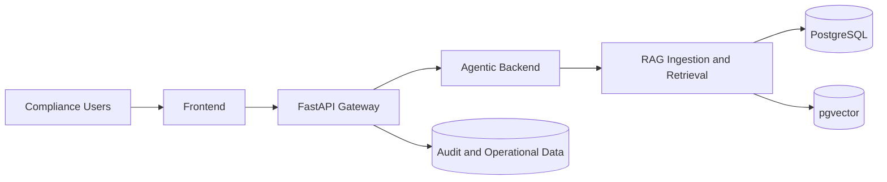

# CORA Solution Architecture Review Board Document

Document ID: CORA-SARB-001  
Version: 1.0  
Date: 2026-06-10 
Prepared For: Architecture Review Board, Security, Platform, Compliance, Product

## 1. Executive Summary

CORA (Compliance Oriented Regulatory Assistant) is a multi-service AI platform for financial compliance workflows. It combines retrieval-augmented reasoning, specialized domain agents, and API-driven integration to support:

- Regulatory Q&A with citations
- Transaction compliance screening with risk rationale
- Regulatory change impact analysis
- Structured report generation
- Audit-ready traceability

Current implementation is production-oriented at service layout level (frontend, API, agentic backend, data layer, Kubernetes manifests) but still requires hardening in identity, security controls, asynchronous processing, and observability before enterprise production rollout.

## 2. Business Context and Objectives

Problem:

- Regulatory knowledge is high-volume and frequently changing.
- Manual compliance interpretation and transaction review is slow and inconsistent.
- Audit traceability demands explainable decisions with source evidence.

Objectives:

1. Reduce manual compliance analysis effort.
2. Improve speed and consistency of regulatory interpretation.
3. Provide explainable outputs with citations and reproducible evidence trails.
4. Establish a scalable architecture for cross-jurisdiction compliance use cases.

## 3. In-Scope and Out-of-Scope

In scope:

- Frontend, backend API, agentic backend, RAG, and data storage architecture
- Container and Kubernetes deployment model
- Core security and observability recommendations
- Evaluation and quality posture

Out of scope (for this release document):

- Detailed UI/UX specification
- Full legal interpretation policy and jurisdiction-specific legal sign-off process
- Disaster recovery runbook detail
- Full infra-as-code blueprint

## 4. Current Architecture Overview

## 4.1 System Context

## 4.2 Deployment View (Current)

- Services are containerized with service-level Dockerfiles.
- Kubernetes manifests exist for frontend, backend API, and backend agentic services.
- Worker responsibilities (ingestion/reporting/retrieval) are mostly in-process and not yet independently deployable.

## 4.3 Architecture Style

- Service-oriented architecture with bounded responsibilities
- Agent-orchestrated reasoning using a root-and-subagent pattern
- Retrieval-augmented generation pattern for grounded answers
- Shared relational + vector persistence

## 5. Requirements Traceability Summary

| Requirement | Capability | Primary Components |
|---|---|---|
| FR1 Ingestion | Parse, chunk, embed, store | Agentic RAG ingestion, PostgreSQL, pgvector |
| FR2 Q&A | Grounded answers with citations | Retrieval agent, RAG retrieval, citation tool |
| FR3 Screening | Risk analysis and rationale | Risk agent, risk calculator, retrieval/citation tools |
| FR4 Change impact | Delta interpretation and impact summary | Change impact agent, retrieval layer |
| FR5 Reporting | Structured compliance reporting | Report agent, API report endpoints |
| FR6 Auditability | Evidence trace and explainability | Audit endpoints, citation flow, logs |
| FR7 Evaluation | Retrieval and answer quality validation | Evaluation module with RAGAS workflows |

## 6. Assumptions

1. Open-source model serving remains the preferred strategy for data-control and cost predictability.
2. Regulatory source documents can be legally stored and processed in internal infrastructure.
3. PostgreSQL with pgvector remains acceptable for initial scale targets.
4. Current user concurrency is moderate and can be handled by horizontal scaling of API and agent services.
5. Organizational controls for model governance and prompt governance will be introduced in parallel.

## 7. Constraints

1. Current codebase has partial enterprise controls (authz, queueing, centralized observability are incomplete).
2. Worker workloads are not fully decoupled from request-path services.
3. Local file upload storage is still used in current implementation.
4. Dedicated model serving and GPU scheduling strategy is not fully externalized in Kubernetes artifacts.
5. Security controls beyond baseline middleware and secrets references need implementation.

## 8. Non-Functional Requirements and Target SLOs

| Category | Target |
|---|---|
| Availability | 99.9% monthly for API and core chat/screening paths |
| Latency | P95 <= 3s for typical Q&A; P95 <= 6s for complex screening |
| Scalability | Horizontal scaling for API and agent services; independent worker scale |
| Security | Strong authN/authZ, least-privilege, encryption at rest/in transit |
| Auditability | 100% response trace with citation and request correlation ID |
| Observability | End-to-end tracing, centralized logs, golden-signal dashboards |
| Reliability | Queue-backed retries for ingestion/report jobs |

## 9. Security and Compliance Posture

Current posture:

- Environment-driven configuration and secrets use
- API CORS controls
- Basic logging and trace hooks

Required controls before production:

1. Authentication and role-based authorization.
2. Secret manager integration and key rotation policy.
3. Workload identity / service identity controls.
4. Network policy, ingress hardening, and threat protection controls.
5. Encryption policies for storage, transport, and backups.
6. Formal audit retention and immutable event policy.

## 10. Data Architecture and Governance

Data categories:

- Regulatory documents and metadata
- Chunked text and embeddings
- User prompts and model outputs
- Compliance assessments and reports
- Audit evidence bundles

Governance controls required:

1. Data classification and retention policy.
2. PII handling and redaction strategy where applicable.
3. Provenance and versioning policy for ingested regulatory content.
4. Backup and restore procedures with defined RPO/RTO.

## 11. Observability and Operations

Current state:

- Application logs and partial tracing configuration

Target operational model:

1. Centralized structured logging.
2. Metrics pipeline for service, model, and retrieval behavior.
3. Distributed traces from frontend request to agent/tool execution.
4. SLO dashboards and alerting runbooks.

## 12. Risk Register

| ID | Risk | Impact | Likelihood | Mitigation | Owner |
|---|---|---|---|---|---|
| R1 | Missing authN/authZ in core paths | High | Medium | Implement OIDC/JWT and RBAC before go-live | Platform + Security |
| R2 | In-process worker coupling causes contention | Medium | High | Move ingestion/reporting to queue-backed workers | Backend |
| R3 | Limited observability slows incident resolution | High | Medium | Implement logs/metrics/traces and alerting | SRE |
| R4 | Model response quality drift over time | Medium | Medium | Add periodic eval gates and regression checks | AI Engineering |
| R5 | Citation quality gaps in edge cases | High | Medium | Strengthen citation validation and confidence gating | AI Engineering |
| R6 | Local upload storage not production-grade | Medium | High | Move to managed object storage and lifecycle controls | Platform |
| R7 | Cost variance due to model serving workload | Medium | Medium | Define autoscaling and model tiering strategy | Platform + FinOps |

## 13. Delivery Roadmap

Phase 1: Foundation Hardening (2-4 weeks)

1. Implement authentication and authorization.
2. Centralize observability stack.
3. Enforce API request tracing and audit correlation IDs.

Phase 2: Runtime Decoupling (2-4 weeks)

1. Introduce async queue and worker deployments.
2. Externalize ingestion/report pipelines.
3. Add retry, dead-letter, and idempotency controls.

Phase 3: Production Readiness (2-4 weeks)

1. Migrate local document storage to managed object storage.
2. Finalize security controls and policy checks.
3. Execute load, resilience, and DR validation.

## 14. Decision Log

| ADR | Decision | Status |
|---|---|---|
| ADR-001 | Use multi-service split: frontend, API, agentic backend | Approved |
| ADR-002 | Use root + specialized subagent orchestration | Approved |
| ADR-003 | Use RAG with citation-first answer contract | Approved |
| ADR-004 | Use PostgreSQL + pgvector for unified persistence | Approved |
| ADR-005 | Use containerized Kubernetes deployment baseline | Approved with conditions |
| ADR-006 | Introduce queue-backed workers for async paths | Proposed |
| ADR-007 | Introduce enterprise authN/authZ and centralized observability | Proposed |

## 15. Open Questions for Review Board

1. Which identity provider and token standard is mandated for production?
2. What audit retention period is required by policy and jurisdiction?
3. Should model serving run on dedicated GPU node pools from day one?
4. What is the approved data residency boundary for regulatory documents?
5. What are go-live acceptance thresholds for hallucination and citation error rate?

## 16. Review Checklist and Sign-Off

Required approvals:

- Architecture
- Security
- Platform/SRE
- Compliance/Legal
- Product Owner

Release gate criteria:

1. High and critical security findings resolved.
2. AuthN/authZ enforced on production APIs.
3. Audit traceability validated end-to-end.
4. Observability dashboards and alerts operational.
5. Performance and resilience tests meet agreed thresholds.

## 17. Repository References

- `README.md`
- `docs/Architecture_Document.md`
- `docs/cora-ai.md`
- `docs/cora_github_structure.md`
- `backend_api/`
- `backend_agentic/`
- `data_layer/`
- `evaluation/`
- `k8s/`
