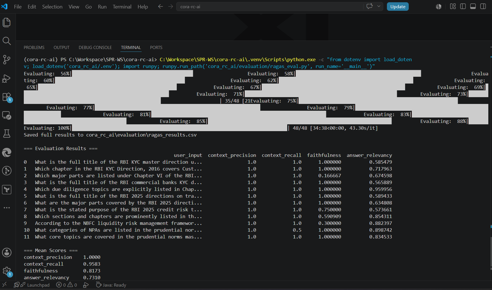
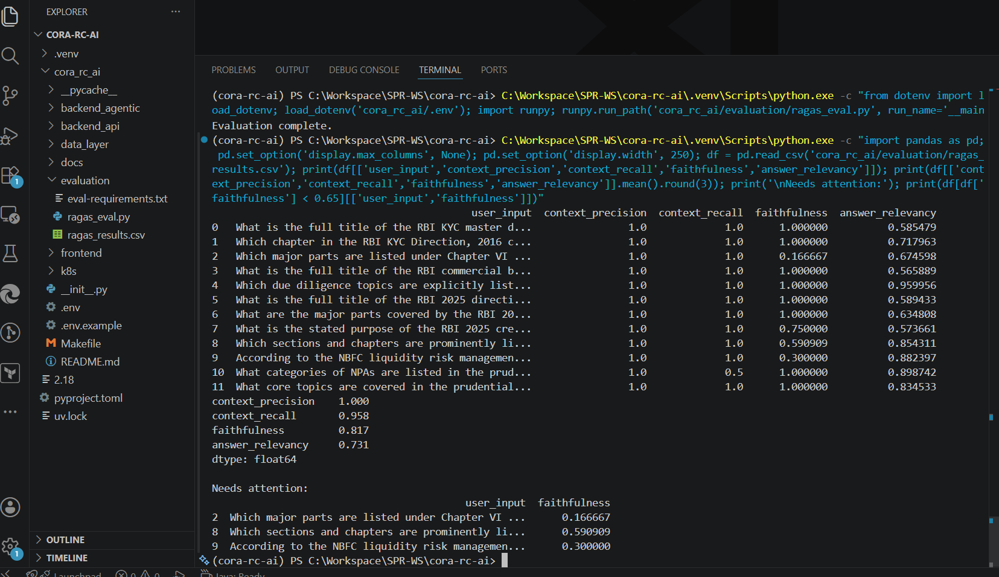
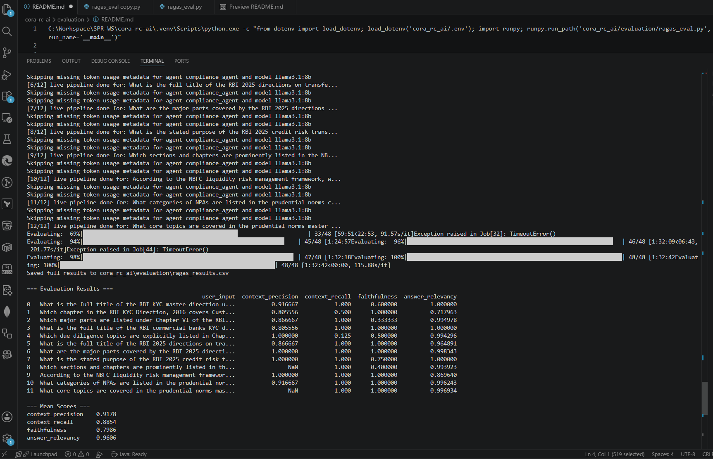
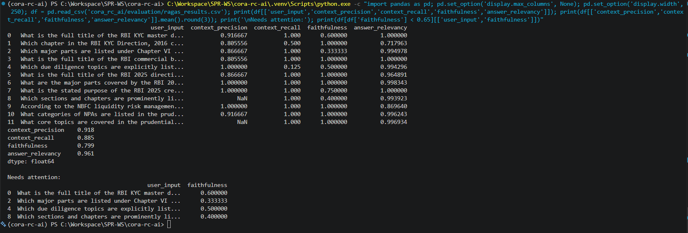
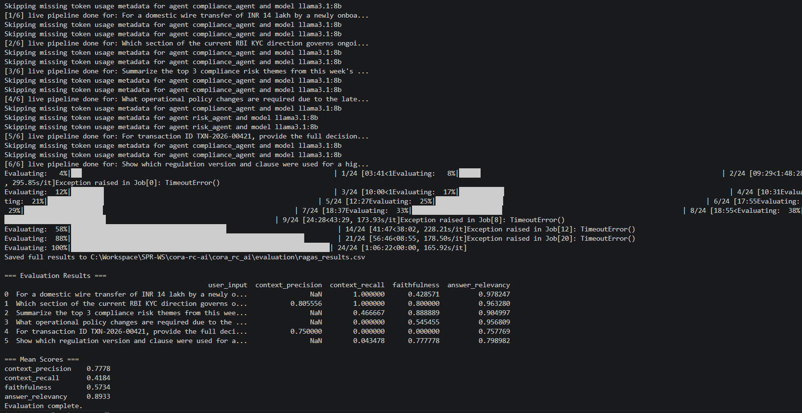
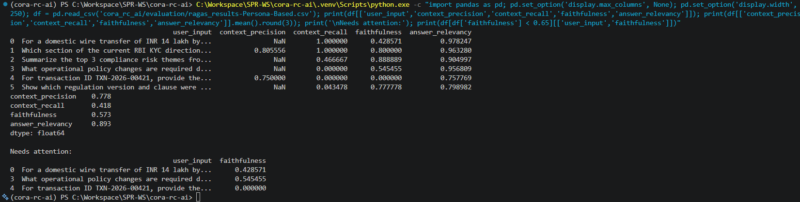

# CORA RAGAS Evaluation

Automated evaluation of the CORA RAG pipeline using [RAGAS](https://docs.ragas.io/).
It scores four metrics per question:

- **context_precision** — are the retrieved chunks relevant?
- **context_recall** — was the information needed to answer actually retrieved? (needs `ground_truth`)
- **faithfulness** — is the answer grounded in the retrieved context (no hallucination)?
- **answer_relevancy** — does the answer actually address the question?

The framework runs in two modes:

- **Static (default)** — scores the built-in persona mini set (6 questions total: 2 each for Compliance Officer, Compliance Head, Internal Auditor). Fast sanity check.
- **Live (`LIVE_EVAL=true`)** — populates `contexts` from the real `HybridRetriever`
  and `answer` from the real compliance agent, then scores them. This measures the
  *actual* production pipeline.

---

## Package structure

The logic is split into small, single-responsibility modules following SOLID design.

| Module | Responsibility |
|---|---|
| `env_setup.py` | Import-time environment hardening — disables LangSmith/LangChain tracing and forces HuggingFace/transformers offline **before** ragas/langchain load. |
| `config.py` | `EvalConfig.from_env()` — one immutable, typed snapshot of all runtime settings (models, paths, toggles). Single source of configuration. |
| `sample_data.py` | Built-in fallback gold dataset (RBI compliance Q&A). |
| `data_sources.py` | `EvalDatasetSource` abstraction + `FallbackDatasetSource` / `JsonFileDatasetSource` + `resolve_dataset_source()` factory. Add new formats here without touching the rest. |
| `live_pipeline.py` | `AgentRunner` + `LivePipelinePopulator` — query the real retriever and run the compliance agent to fill `contexts` / `answer`. |
| `evaluator.py` | `RagasEvaluator` — turns a dataset dict into a scored DataFrame (owns the ragas/langchain/Ollama/HF imports). |
| `reporters.py` | `ResultSink` abstraction + `CsvResultWriter`, `ConsoleReporter`, `LangSmithResultSink`. Each output destination is independent. |
| `orchestrator.py` | `EvaluationOrchestrator` — wires source → populator → evaluator → sinks via injected dependencies. |
| `ragas_eval.py` | Thin entrypoint / composition root (`build_orchestrator`). This is what you run. |

Output is written to `ragas_results.csv` in this folder.

---

## Prerequisites

- Python venv at `.venv` with eval dependencies installed (`evaluation/eval-requirements.txt`).
- **Ollama** running locally (default model `llama3.1:8b`) for the RAGAS evaluator LLM.
- Embeddings model `BAAI/bge-large-en-v1.5` already cached locally (offline mode is forced).
- **Live mode only**: Postgres/pgvector reachable with documents ingested, so the
  retriever and compliance agent can run end-to-end.

---

## How to run

> Run all commands from the repo root: `C:\Workspace\SPR-WS\cora-rc-ai`.

### 1. Static evaluation (default — scores built-in gold data)

```powershell
C:\Workspace\SPR-WS\cora-rc-ai\.venv\Scripts\python.exe -c "from dotenv import load_dotenv; load_dotenv('cora_rc_ai/.env'); import runpy; runpy.run_path('cora_rc_ai/evaluation/ragas_eval.py', run_name='__main__')"
```

### 2. Live evaluation (scores the real retriever + compliance agent)

```powershell
$env:LIVE_EVAL="true"
C:\Workspace\SPR-WS\cora-rc-ai\.venv\Scripts\python.exe -c "from dotenv import load_dotenv; load_dotenv('cora_rc_ai/.env'); import runpy; runpy.run_path('cora_rc_ai/evaluation/ragas_eval.py', run_name='__main__')"
```

### 2a. Live evaluation with explicit persona mini evalset JSON

```powershell
$env:LIVE_EVAL="true"
$env:EVALSET_PATH="cora_rc_ai/evaluation/evalsets/persona_mini_6q.json"
C:\Workspace\SPR-WS\cora-rc-ai\.venv\Scripts\python.exe -c "from dotenv import load_dotenv; load_dotenv('cora_rc_ai/.env'); import runpy; runpy.run_path('cora_rc_ai/evaluation/ragas_eval.py', run_name='__main__')"
```

Switch back to static mode in the same terminal:

```powershell
$env:LIVE_EVAL="false"
$env:EVALSET_PATH=""
C:\Workspace\SPR-WS\cora-rc-ai\.venv\Scripts\python.exe -c "from dotenv import load_dotenv; load_dotenv('cora_rc_ai/.env'); import runpy; runpy.run_path('cora_rc_ai/evaluation/ragas_eval.py', run_name='__main__')"
```

### 3. Inspect saved results (mean scores + low-faithfulness rows)

```powershell
C:\Workspace\SPR-WS\cora-rc-ai\.venv\Scripts\python.exe -c "import pandas as pd; pd.set_option('display.max_columns', None); pd.set_option('display.width', 250); df = pd.read_csv('cora_rc_ai/evaluation/ragas_results.csv'); print(df[['user_input','context_precision','context_recall','faithfulness','answer_relevancy']]); print(df[['context_precision','context_recall','faithfulness','answer_relevancy']].mean().round(3)); print('\nNeeds attention:'); print(df[df['faithfulness'] < 0.65][['user_input','faithfulness']])"
```

---

## Evaluations results

Screenshots of evaluation runs are stored under `evaluation_screenshots/`.

### Static evaluation (built-in gold dataset)



Rows flagged for low faithfulness in the gold-data run:



### Live evaluation (real retriever + compliance agent)



Rows flagged for low faithfulness in the live run:



### Persona-based live evaluation (6-question mini evalset)

This run scores the live retriever + compliance agent against the persona-balanced
mini evalset (`evalsets/persona_mini_6q.json`: 2 questions each for Compliance
Officer, Compliance Head, and Internal Auditor).



Per-question scores:

| # | Question (persona) | context_precision | context_recall | faithfulness | answer_relevancy |
|---|---|---|---|---|---|
| 0 | Domestic wire transfer, INR 14 lakh, incomplete KYC (Compliance Officer) | NaN | 1.000 | 0.429 | 0.978 |
| 1 | RBI KYC ongoing due diligence section (Compliance Officer) | 0.806 | 1.000 | 0.800 | 0.963 |
| 2 | Top 3 compliance risk themes this week (Compliance Head) | NaN | 0.467 | 0.889 | 0.905 |
| 3 | Operational policy changes from latest CDD update (Compliance Head) | NaN | 0.000 | 0.545 | 0.957 |
| 4 | Full decision trail for TXN-2026-00421 (Internal Auditor) | 0.750 | 0.000 | 0.000 | 0.758 |
| 5 | Regulation version + clause for high-risk decision (Internal Auditor) | NaN | 0.043 | 0.778 | 0.799 |

Mean scores across the 6 persona questions:

| Metric | Score |
|---|---|
| context_precision | 0.778 |
| context_recall | 0.418 |
| faithfulness | 0.573 |
| answer_relevancy | 0.893 |

Rows flagged for low faithfulness (`faithfulness < 0.65`) in the persona run:



| # | Question (persona) | faithfulness |
|---|---|---|
| 0 | Domestic wire transfer, INR 14 lakh, incomplete KYC (Compliance Officer) | 0.429 |
| 3 | Operational policy changes from latest CDD update (Compliance Head) | 0.545 |
| 4 | Full decision trail for TXN-2026-00421 (Internal Auditor) | 0.000 |

**Observations:**

- **answer_relevancy is consistently strong** (0.76–0.98, mean 0.893) — the agent's
  responses stay on-topic for every persona.
- **context_recall is the weakest area** (mean 0.418), driven by the Internal Auditor
  transaction-trace questions (#4, #5) and the Compliance Head policy question (#3),
  where the retriever pulled little or none of the expected supporting evidence.
- **faithfulness for the TXN-2026-00421 trace (#4) is 0.000** — the auditor decision-trail
  question has no grounded transaction data to retrieve, so the answer is unsupported.
  This and the two other flagged rows are the priority items to improve (better
  transaction-evidence retrieval and tighter grounding for policy-change summaries).

---


## Configuration (environment variables)

| Variable | Default | Purpose |
|---|---|---|
| `LIVE_EVAL` | `false` | `true` runs the real retriever + agent instead of static gold data. |
| `LIVE_RETRIEVE_LIMIT` | `5` | Number of chunks retrieved per question in live mode. |
| `EVALSET_PATH` | _(unset)_ | Path to a JSON evalset (keys: `question`, `answer`, `contexts`, `ground_truth`). Falls back to built-in sample if unset/missing. |
| `RAGAS_EVAL_MODEL` | `llama3.1:8b` | Ollama model used as the RAGAS evaluator LLM. |
| `RAGAS_EMBED_MODEL` | `BAAI/bge-large-en-v1.5` | HuggingFace embeddings model for scoring. |
| `RAGAS_TIMEOUT` | `600` | Per-job timeout (seconds) for RAGAS. |
| `RAGAS_MAX_WORKERS` | `2` | Concurrency — keep low so local Ollama isn't overwhelmed. |
| `EVAL_APP_NAME` | `cora_eval` | ADK app name used by the live agent runner. |
| `ENABLE_LANGSMITH_LOGGING` | `false` | `true` logs runs + metric feedback to LangSmith (needs a valid key). |
| `LANGSMITH_PROJECT` | `cora-rc-ai` | LangSmith project name when logging is enabled. |

---

## Notes

- Live mode is significantly slower — each question triggers retrieval + a full multi-agent
  LLM turn, *plus* the RAGAS scoring calls. Start small if iterating.
- The `Skipping missing token usage metadata ...` log in live mode is harmless: Ollama's
  OpenAI-compatible endpoint doesn't return token counts, so ADK skips that bookkeeping.
  Optional: silence those ADK logs, If you want a cleaner console, add this near the top of ragas_eval.py (after the imports)
  
  ```
  import logging
  logging.getLogger("google_adk").setLevel(logging.ERROR)
  ```